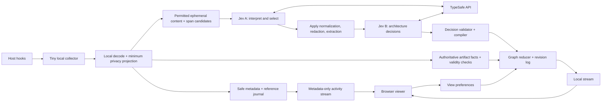

# Graphlin: live architecture from observable agent work

Design proposal · 19 September 2026 · Revised after independent review

Graphlin watches a coding agent work and updates a local architecture diagram as the application takes shape. A second, synchronized view explains the agent’s **observable work**: its stated intent, files inspected, attempted changes, tool outcomes, and verification steps.

The recommended architecture is a passive hook collector, a local event service, a **reusable Jev decision service**, a deterministic diagram compiler, and a browser renderer. The main workflow uses Jev twice: first to interpret and prepare incoming evidence, then to decide its architectural meaning. The primary semantic path gives focused code snippets directly to Jev to evaluate architectural propositions; specialized parsers are optional context/extraction aids. Additional bounded Jev decisions can improve entity matching, grouping, and contradiction detection. Jev chooses among supplied alternatives; local code applies those decisions and supplies exact text, evidence, identities, drawing commands, and coordinates.

This document records the broader design proposal. The [implementation plan](implementation-plan.md)
defines the first runnable slice, and the [README](../README.md) explains how to run it.
The next phase is specified in the [visualizer platform plan](visualizer-platform-plan.md):
source-first discovery, a shared evidence model, and extensible architecture views.
That plan is planning-only; it does not describe features already shipped.
The accompanying design walkthrough still replays illustrative events without
making Jev calls; the runtime serves a separate live viewer. Host activation
has not been certified. See [live Jev findings](jev-integration-findings.md)
and the later [pattern review](jev-patterns.md) for measured behavior and
the proposed intent-routing extension.

## 1. The product contract

The experience should feel like watching an architect’s drawing evolve while someone builds:

1. Start Graphlin once for the current project.
2. Continue using the coding agent normally.
3. See the component currently under discussion or modification highlighted.
4. See proposed components become observed artifacts as evidence arrives.
5. Click any component or relationship to see why it exists and what supports it.
6. Scrub backward to see when the architecture changed.

There are two related models:

| View | What it describes | Example |
|---|---|---|
| Application architecture | Components and relationships supported by public statements, source, configuration, and execution evidence | Notes API writes to a PostgreSQL database |
| Work activity | Stated goals and observed actions, with parallel agent lanes | Proposing storage → editing repository → running tests |

Call the second view **Work activity** or **Intent & actions**, rather than claiming access to private reasoning. A public sentence such as “I’ll add persistence next” can support an intent node. An edit supports an attempted change. Neither proves that persistence works.

### Important correction to the original hook idea

There is no verified, portable hook that delivers private thinking before every internal model step. The initial user prompt happens before the agent has produced its next decision; a pre-tool event happens after the model has chosen a tool. Claude’s `PostToolBatch` offers a useful boundary before the next model request, and `MessageDisplay` exposes displayed assistant text, but neither promises private reasoning. [C1]

Graphlin must therefore work without hidden chain-of-thought. It can visualize concise public intent, explicit plans, tool arguments/results, and verified repository changes. If a host later offers a documented public summary event, an adapter can ingest it as an additional source.

## 2. What “universal plugin” means here

Use **Agent Plugins Specification 1.0.0** as the portable package contract. It specifies a root `plugin.json`, fixed `skills/` discovery, and root `mcp.json`. Its two portable component types are skills and MCP servers. Hook semantics are client extensions. This is a shared packaging standard, not a shared event-observation API. [P1]

Maintain one source tree and produce a portable package plus tested native distributions. Do not assume that every installed Claude, Codex, or Kiro version loads the portable manifest or the same hook file.

```text
graphlin/
  plugin.json                         # Agent Plugins 1.0.0 manifest
  mcp.json                            # Portable stdio control server
  skills/
    graphlin/SKILL.md                 # Start, stop, inspect, explain coverage
  scripts/
    control.mjs                       # Bundled MCP entry point
  runtime/
    collector/                        # Small platform-specific executables
    daemon/                           # Ingestion, local state, Jev worker
    web/                              # Bundled viewer assets
  adapters/
    claude/                           # Source templates; not core discovery
    codex/
    kiro/
  schemas/
    event-v1.json
    decision-v1.json
    diagram-patch-v1.json
  tests/
    fixtures/
  dist/                               # Generated at release time
    portable/
    claude/                           # .claude-plugin/plugin.json + hooks
    codex/                            # Portable + com.openai; legacy variant as needed
    kiro/                             # Format selected after host validation
```

Minimal portable manifest:

```json
{
  "$schema": "https://agent-plugins.org/schemas/1.0.0/plugin.schema.json",
  "name": "graphlin",
  "version": "0.1.0",
  "description": "Live architecture and activity diagrams from coding-agent events."
}
```

Portable MCP configuration, with a packaged script and a documented Node runtime requirement:

```json
{
  "$schema": "https://agent-plugins.org/schemas/1.0.0/mcp.schema.json",
  "mcpServers": {
    "graphlin": {
      "type": "stdio",
      "command": "node",
      "args": ["${PLUGIN_ROOT}/scripts/control.mjs"],
      "cwd": "${PLUGIN_DATA}"
    }
  }
}
```

The portable standard expands `PLUGIN_ROOT` and `PLUGIN_DATA` in supported argument/configuration fields; it does not provide arbitrary environment-variable substitution or a portable secret reference. Keep writable runtime state outside the installed package, and use a local credential provider configured during setup. Do not put an API key into either manifest. [P2]

Current Codex build documentation explicitly supports the portable root manifest and `extensions.com.openai`, with `.codex-plugin/plugin.json` as a compatibility fallback. Prefer the portable format for a current supported Codex release; generate a legacy variant only for a tested target that needs it. Claude’s native package requires its own manifest, MCP configuration shape, component discovery, and variable substitutions. Packaging generation must translate those contracts, not just relocate a JSON file. [O3, C2]

The skill controls the viewer and explains its coverage. It does **not** ask the main agent to call a drawing tool after each action. An MCP server alone does not observe other servers’ calls or the host’s internal activity.

### Host adapters

| Capability | Claude Code first | Codex next | Kiro later |
|---|---|---|---|
| Native package | `.claude-plugin/plugin.json` | Portable manifest + `extensions.com.openai`; legacy fallback when needed | Validate supported distribution mechanism for the target release |
| Prompt boundary | `UserPromptSubmit` | `UserPromptSubmit` | Prompt Submit; payload differs by surface |
| Before tools | `PreToolUse` | `PreToolUse`, with documented coverage gaps | Pre Tool Use |
| After tools | `PostToolUse` and `PostToolUseFailure` | `PostToolUse`; normalize actual returned outcome | Post Tool Use |
| Iteration boundary | `PostToolBatch` when available | No equivalent assumed | No equivalent assumed |
| Public assistant text | `MessageDisplay` when available; final-message fallback | Supported public output/transcript adapter, otherwise final-message fallback | Only exposed public output supported by the target release |
| Lifecycle | Start, stop, subagent, interruption/error signals where available | Start, stop, subagent, interrupt signals | Surface-specific session/agent events |
| Full private reasoning | Not a requirement or a guarantee | Not a requirement or a guarantee | Not a requirement or a guarantee |

Sources: Claude hook/plugin references [C1, C2]; Codex hook/plugin references [O1, O2]; Kiro hook documentation [K1, K2].

Codex’s documented hook coverage excludes hosted tools such as web search, and repeated `write_stdin` interactions do not each fire a new pre-tool event. Its transcript format is explicitly not a stable hook API. Treat missing events as missing coverage, not as evidence that nothing happened. [O1]

Kiro exposes different triggers in IDE and CLI, with no corresponding web coverage in the current trigger table. Ship separate tested adapter profiles rather than copying Claude configuration. [K1]

Add a local `doctor` command that checks host version, hook activation/trust, runtime availability, event payloads, credential access, and viewer connectivity. Display the resulting coverage: **tools + public intent**, **tools only**, or **manual control only**.

## 3. End-to-end architecture



Only the decision service communicates with TypeSafe. Both Jev stages share its connection, scheduler, budgets, versioned question catalog, and audit trail. The browser receives sanitized graph state and activity, never the TypeSafe key.

The immediate activity stream contains only allowlisted metadata while semantic classification is pending. Approved text arrives after contextual filtering. Authoritative artifact changes can invalidate obsolete evidence directly, without waiting for Jev. This keeps progress and evidence freshness visible during a network outage.

### Component responsibilities

| Component | Owns | Does not infer |
|---|---|---|
| Collector | Copy an event, assign transport identity, enqueue locally, return silently | Architecture or tool success |
| Local input preparation | Parse host schema, correlate IDs, minimum privacy filter, size limits, candidate spans | Missing host events |
| Jev A: intake decisions | Semantic event class, candidate relevance/role, permitted-span sensitivity, field-to-schema mapping | New text, missing spans, safe-to-export authorization |
| Normalizer/extractor | Apply selected mappings and redactions; copy exact source spans and structured facts | Arbitrary new facts |
| Jev B: graph decisions | Component roles, candidate relationships, semantic alignment, prominence | New text, coordinates, commands |
| Compiler | Convert accepted decisions and facts into valid graph mutations | Unobserved execution success |
| Reducer | Apply mutations atomically, version state, preserve provenance | Model intent |
| Viewer | Render, animate changes, replay, inspect, pin layout | Architecture truth |

## 4. Capture without changing agent behavior

### The synchronous hook is just a collector

Every registered hook follows this contract:

1. Read a bounded payload from the host.
2. Send it through ephemeral local IPC. Before any disk write, project onto a bounded allowlist of safe metadata and artifact references. The daemon applies this projection before journaling; a collector fallback spool uses the same projection.
3. Return a tested inert success response: ordinarily exit code `0` with **empty stdout and stderr**. If a particular host/event requires JSON, emit only its verified inert acknowledgement, with no context or control fields.

Never return permission decisions, updated tool input, additional context, display replacement text, or stop/continue directives. Diagnostics go to the Graphlin service, not the agent conversation. The initial metadata allowlist is opaque project/session/agent/call IDs, event kind, timing/sequence, tool category, and non-content outcome codes. Paths use local opaque references until policy permits their display; commands, arguments, names, messages, and result bodies are not immediate-feed metadata.

A short local handoff is preferable as the baseline because it reduces capture lag. It does not serialize concurrent host tools or prove their execution order. Use a native async hook only after validating its lifecycle and shutdown behavior. Do not make a remote Jev request inside a hook, even if the median API response is fast.

The collector has its own wall-clock deadline; the host’s often generous hook timeout is only a final ceiling. An unavailable service, full spool, malformed event, or disk failure must let the agent proceed. Count losses where possible and display a coverage gap after recovery.

This promises **no deliberate changes to agent inputs, outputs, or decisions**. It does not promise literally zero timing overhead: launching any hook costs time.

Use a quiet, guarded launcher for each host/OS: bundled or prevalidated executable, correctly quoted paths, suppressed launcher output, and a deadline below the host timeout. Test missing binaries and shell/runtime failures outside the collector itself. Use passive shell/command actions, not agent-prompt hooks or lifecycle overrides that require implementing host behavior. Codex stop-handler output and Kiro blocking-on-shell-error behavior require explicit compatibility fixtures; omit an event if no passive launch contract can be demonstrated. [O1, K2]

### Service lifecycle

Start the daemon when the user starts Graphlin or at an enabled session-start hook. Use an OS lock, a process identity record, and a health handshake to prevent duplicate daemons. A hook may try a bounded local launch, but must not wait for network access or full indexing.

Use a Unix-domain socket on macOS/Linux, with a named-pipe or authenticated loopback fallback on Windows. The viewer is served on loopback on an available port recorded by the daemon; the port number is not treated as a secret.

Scope journals and graphs to project, worktree, and session. Opening another worktree should not merge its pending changes into the current graph. A shared daemon may serve multiple sessions while keeping their queues and state separate.

At stop, close the **turn**, not necessarily the whole session: background tasks may still be running. Only an explicit interruption signal makes an attempt interrupted; missing terminal evidence expires to unresolved. Flush accepted events independently of the host process. Track process/session liveness separately from stop hooks, with a heartbeat/lease and idle grace period so a lost terminal event cannot retain a live session forever.

## 5. Common event and evidence model

Illustrative normalized event:

```json
{
  "schemaVersion": 1,
  "eventId": "evt-1042",
  "projectId": "project-4",
  "worktreeId": "worktree-main",
  "sessionId": "session-7",
  "agentId": "agent-root",
  "turnId": "turn-12",
  "toolCallId": "tool-28",
  "host": "claude",
  "kind": "tool.requested",
  "sourceEvent": "PreToolUse",
  "sourceSequence": null,
  "ingestSequence": 1042,
  "observedAt": "2026-09-19T10:20:30.000Z",
  "tool": {
    "name": "Write",
    "operation": "write_file",
    "path": "src/notes/repository.ts"
  },
  "evidence": [],
  "coverage": {
    "publicIntent": true,
    "toolResults": true,
    "repositoryReconciliation": false
  }
}
```

Normalized kinds include:

```text
session.started       turn.prompted          intent.observed
tool.requested        tool.succeeded         tool.failed
tool.interrupted      tool.denied            tool.unresolved
batch.completed       artifact.changed      verification.observed
agent.started         agent.stopped          turn.stopped
session.ended         capture.gap
```

These are Graphlin names, not proposed host hook names.

`tool.requested` is pending intent to invoke a tool, not proof that execution started. Normalize a running state only when the host provides an appropriate execution signal.

| Terminal case | Claude adapter | Codex adapter | Kiro adapter |
|---|---|---|---|
| Tool completes | Correlated post-tool result | Correlated post-tool result, including later unified-exec completion | Post-tool result; verify actual identifier availability |
| Execution fails | Failure hook/result as exposed | Inspect actual post-tool outcome | Inspect actual post-tool outcome |
| Permission denied | Dedicated denial signal where available; pre-tool alone is insufficient | Map only an exposed denial/result signal | No universal denial signal assumed |
| Input validation rejected | Can precede pre-tool/failure hooks | Do not infer from absence | Do not infer from absence |
| User cancels/interruption | Stop/failure hooks do not cover every cancellation; use an exposed result or leave unresolved | Main-session `Interrupt`; no subagent equivalent assumed | Validate by named IDE/CLI release |
| Background/subagent finishes | Correlate its own result/lifecycle identity | Correlate subagent/unified-exec identities | Validate identifiers; otherwise retain unknown attribution |

This is a minimum adapter checklist, not a guarantee of identical host coverage. The compatibility suite records which signals actually fire on the supported release. [C1, O1, K1, K2]

An evidence record carries a source event, local artifact reference, relevant span, content hash, extractor version, and **what it proves**. A successful file-write tool proves the write completed. A parser can establish a declared dependency. A test can verify a named behavior at a particular revision. These are different claims.

For semantic relationships, the normal path is **code snippet → Jev judgment → attributed graph claim**. A parser does not need a custom recognizer for every ORM, database driver, or project wrapper before Jev can evaluate the supplied code. Preserve the distinction between the observed code and Jev’s interpretation of its behavior.

Store original host identifiers when supplied. Do not match parallel calls using timestamps alone. Generate a local event UUID when no stable source identity exists, and retain it across spool retries. Deduplicate source events by their actual host/session/message-or-call identity and event phase. For Claude display batches, deduplicate by message ID and batch index; do not equate that display ID with a transcript message ID. [C1]

Assemble public messages from **all** ordered `delta` batches, keyed by session/agent/display-message ID; close on `final` even if that final delta is empty. Missing indices mark incomplete content. Every partial interpretation carries a message-content version, so a late classification cannot replace a newer complete interpretation. Withdraw superseded proposed claims from the live view when the source proposal is revised, retaining both in history.

Map per-tool and post-batch results onto one logical call/evidence identity. A batch may add missing detail, but does not double the evidence count or automatically trigger another semantic evaluation of the same result.

### Candidate discovery and intelligent extraction

Jev can participate directly in extraction by selecting supplied spans and classifying their roles. It cannot invent a node label or return an arbitrary new string outside its answer space. Before the early Jev pass, local code supplies candidates from:

1. Structured tool arguments and confirmed changed-file lists.
2. Changed code snippets, nearby imports, and enclosing definitions; optional language parsers improve selection and reference resolution.
3. Infrastructure/configuration snippets; optional format-aware parsers identify exact fields and resource names.
4. Exact spans in public statements: filenames, quoted names, known framework/service terms.
5. Existing graph entities and a bounded neighborhood around changed artifacts.

Jev A can choose which spans represent component names, which fields map to a normalized concept, and which candidates belong in the event’s evidence set. Local code copies the selected text verbatim, preserving its original source range. Multiple candidates use per-candidate questions; no forced single winner for a multi-entity event.

Start with changed text and bounded surrounding context, with optional TypeScript/JavaScript and JSON/YAML helpers. Jev evaluates whether that text supports an architectural proposition, including in code without a dedicated semantic analyzer. A parser is an optimization for boundaries, references, and exact facts; comprehensive static analysis is not a prerequisite for a classified edge. Missing names can use an existing candidate or fixed generic label, without inventing an exact resource identity.

Evaluate language/framework coverage empirically and mark incomplete snippets. If context is insufficient, enrich within budget or keep the relation tentative. Shell commands still require post-execution artifact observation because command text alone may not reveal what actually changed.

A broader watcher can notice external edits, but must label attribution as unknown unless a reliable host/artifact correlation exists. Two agents changing the same file are not automatically assigned each other’s edits.

Stable entity identity is separate from display text. Maintain an entity registry anchored by project/worktree plus canonical artifact and symbol/resource identity; reuse stored IDs when labels change. A verified rename rebinds the artifact path. Otherwise mark the relationship as unresolved instead of guessing an identity merge.

### Artifact-time correctness

Tool-supplied edits/results and subsequent filesystem reads are separate observations. Preserve exact supplied bytes where policy permits, with their original event identity. A later read gets its own content hash, capture time, and artifact generation; do not attach it to an earlier actor merely because that actor mentioned the same path.

Track artifact generations independently of graph revisions. Jev A, its selected/redacted bundle, and Jev B must refer to immutable evidence versions. Validate both artifact generations and graph read sets before applying a decision. If historical bytes or exclusive authorship cannot be established, mark the attribution unknown.

Bind a test to the artifact versions it actually exercised. If files changed during the run and that scope cannot be established, retain the check result as an observation without applying a current-verification badge. A passing result arriving last is not proof that the latest working tree passed.

## 6. What Jev is asked to decide

Jev accepts a text string, structured JSON object, or array as `state`. Each request evaluates named questions against the same state. Choice, Score, and Noul can be mixed in that request, with questions evaluated independently. The client must own persistent session and graph state; a request does not establish a stateful conversation with Jev. [J1, J2]

| Primitive | Meaning in Jev | Suggested Graphlin use |
|---|---|---|
| Choice | One supplied alternative, probabilities, confidence | Activity phase; candidate component type; relation kind; existing-entity match |
| Noul | Probability of a supplied yes/no statement; no separate confidence field | Relevance; whether this exact evidence supports this candidate relation |
| Score | Probability-weighted value over ordered rubric levels | Strength of snippet support; visual prominence or architectural significance |

Choice is not a multi-select primitive. Ask one acceptance question per candidate, or use separate per-candidate choices. Include `none`/`unknown` where alternatives are not exhaustive. A numeric score may lie between levels and should not be treated as an integer category. [J3, J4, J5]

### Jev A: normalize, redact, and extract

Treat Jev as an inexpensive intelligent decision primitive throughout the workflow, rather than reserving it for one final classifier. The early pass receives a bounded, already-permitted event and candidate spans:

| Early decision | Primitive | How code uses it |
|---|---|---|
| What semantic activity does this unfamiliar tool describe? | Choice | Map into the normalized activity vocabulary; preserve original host kind |
| What does field/span C represent? | Choice | Map to component name, artifact reference, operation, diagnostic, incidental text, or unknown |
| Is candidate C relevant architectural evidence? | Noul | Select supplied entities/spans for extraction |
| Does permitted span C contain content that should be hidden downstream? | Noul or Choice | Replace the exact span with a typed redaction marker |
| Is this evidence duplicative or newly informative? | Noul | Coalesce presentation noise while retaining the observation journal |
| How much context is needed for this event? | Choice | Select a small, predefined enrichment plan within allowed local sources |

Normalization has both a mechanical and a semantic part. Code decodes the host’s JSON, preserves IDs, and validates types. Jev can interpret ambiguous descriptions and choose field mappings; it does not reconstruct missing IDs or rewrite arbitrary JSON.

Redaction also has two stages. **Before Jev A**, local rules exclude prohibited paths, obvious credentials, disallowed fields, and content not covered by the user’s egress settings. **After Jev A**, code applies its contextual sensitivity classifications to permitted spans before graph inference, durable evidence storage, and browser display. Permission to transmit, persist, and display are separate policy decisions. Anything passed to Jev A has already reached TypeSafe; a remote decision cannot retroactively make that transmission safe. Jev is an additional contextual filter, not the sole privacy boundary. Uncertain redaction decisions remove the affected span from downstream evidence.

Raw payloads are bounded and ephemeral. The durable intake journal contains only the locally filtered envelope, with unapproved free text withheld or replaced by references. If Jev A is unavailable, persist metadata and references rather than storing text that was awaiting contextual redaction. Fetching referenced content later still follows the same privacy gate.

Jev A’s decisions are compiled into an **evidence bundle**, not directly into a graph:

```json
{
  "bundleId": "bundle-1043",
  "eventId": "evt-1043",
  "normalizedActivity": "implement",
  "selectedCandidateIds": ["candidate-c1", "candidate-c4"],
  "selectedEvidenceIds": ["evidence-e1"],
  "redactions": [
    {"spanId": "span-7", "replacement": "[PERSONAL_DATA]"}
  ],
  "enrichment": "nearby_imports",
  "decisionVersion": "intake-v1"
}
```

All IDs must exist in the supplied candidate/span registry. Redaction spans are range-checked against the original content hash, applied together using original offsets, and invalidated after any source change. Redaction overrides selection for overlapping spans. Missing sensitivity answers, conflicts, or abstention exclude that content downstream; a “relevant component” answer cannot override them.

Apply exclusions to every representation: labels, selected spans, event fields, public-intent context, candidate descriptions, graph annotations, logs, and exports. Opaque IDs must not allow a later stage to restore excluded text. Metadata necessary to validate the bundle remains separate from content sent to Jev B.

Enrichment is a bounded transition, not a content approval. Newly read material passes through the local privacy gate and either uses previously approved immutable evidence or receives its own contextual intake evaluation within the shared deadline. Selecting `nearby_imports` does not approve the eventual file content.

### Jev B: architectural decisions

| Question | Primitive | Alternatives or rubric | Application |
|---|---|---|---|
| Does this event contain useful architectural information? | Noul | Existing-architecture discovery, proposal, change, contradiction, or removal | Gate diagram application; retain activity regardless |
| What observable activity is this? | Choice | inspect, propose, implement, verify, repair, explain, other | Reuse Jev A’s accepted answer; ask here only on the direct graph path |
| What role does candidate C have? | Choice | client, service, datastore, queue, external, module, unknown | Node kind |
| Does span E support candidate C as a component? | Noul | Explicitly grounded in E | Candidate acceptance |
| Which existing entity, if any, is candidate C? | Choice | Described candidate IDs plus none | Semantic alignment after exact matching |
| Does supplied code support relation R between A/B? | Noul | One exact proposition per relation/pair | Primary relation admission; read and write can both be supported |
| What relation best describes evidence E for pair A/B? | Choice | calls, reads, writes, publishes, consumes, depends_on, none | Optional routing when a single relation is appropriate |
| How directly do the snippets support the specified relation? | Score | None, unresolved reference, partial implementation, explicit path | Optional evidence-strength diagnostic |
| How significant is this change to architecture? | Score | 0 cosmetic, 1 local, 2 component-level, 3 cross-component | Emphasis only |

### Direct code classification: a database example

We can ask Jev whether a database connection or write path is present directly from the supplied code. Use an exact **code-level** proposition rather than the ambiguous phrase “the database connection is established,” which could imply a successful live connection.

Supply the changed function and the bindings needed to understand it. For example, one permitted, versioned snippet might contain:

```ts
import { Pool } from "pg";
const db = new Pool({ connectionString: process.env.DATABASE_URL });

export function saveNote(text: string) {
  return db.query("INSERT INTO notes (body) VALUES ($1)", [text]);
}
```

The collector/extractor need not know the meaning of every method call. It supplies the text, location, artifact generation, and candidate entities. Jev interprets the snippet. Separate useful questions include:

| Question about these snippets | Primitive | Result used by Graphlin |
|---|---|---|
| Does the code create or configure a PostgreSQL client? | Noul | A code-level client/configuration claim |
| Does `saveNote` implement a PostgreSQL write operation? | Noul | A candidate `saveNote → PostgreSQL` writes edge |
| Do the supplied caller snippets connect the Notes API handler to `saveNote`? | Noul | A separate API-to-function path claim, only if caller evidence is supplied |
| Are definitions needed to resolve the target of `saveNote` missing? | Noul | Enrichment or abstention |
| How directly does the supplied implementation support that write relationship? | Score | Optional support-strength display, not a success probability |

An illustrative request fragment using the documented question shapes:

```json
{
  "questions": {
    "postgres_client": {
      "type": "noul",
      "instructions": "Does state.snippets show code that creates or configures a PostgreSQL client? Evaluate code configuration, not runtime connectivity."
    },
    "writes_postgres": {
      "type": "noul",
      "instructions": "Does the implementation of saveNote in state.snippets contain a path that issues a write to PostgreSQL?",
      "criteria": {
        "true": "The supplied implementation and bindings support a PostgreSQL write operation.",
        "false": "The supplied code does not support that write relationship. A name, comment, import, mock, or database read alone is insufficient."
      }
    },
    "needs_context": {
      "type": "noul",
      "instructions": "Are implementations or bindings needed to determine saveNote's write destination absent from state.snippets?"
    },
    "write_support": {
      "type": "score",
      "instructions": "How directly does state.snippets support the claim that saveNote implements a PostgreSQL write path?",
      "criteria": [
        "The supplied code contains no relevant implementation evidence for the claimed write path.",
        "The supplied code names a possible persistence operation but its implementation and destination are unresolved.",
        "The supplied code shows part of a PostgreSQL write path but a necessary call or binding is unresolved.",
        "The supplied code explicitly connects saveNote to a PostgreSQL write operation through visible bindings and calls."
      ]
    }
  }
}
```

This fragment belongs in a normal `systemOne` request with `state.snippets`, candidate identities, and the selected model. It is a proposed rubric, not a measured Jev result. Noul yields a yes probability that code can threshold into a decision; it is not a literal boolean. Score yields a weighted rubric position and a distribution, not a probability that the connection works. [J4, J5, J6]

Start with the necessary Nouls. Add Score only when its diagnostic value is useful, and batch the independent questions into Jev B’s existing request. These statements can also be evaluated during Jev A when they serve intake decisions; reuse answers only if permitted content, candidate identity, proposition, and evidence versions remain equivalent after redaction. Otherwise evaluate against the final approved bundle.

For an accepted write claim, draw the edge as **“write path classified from code”**, store `basis: jev_interpretation`, and attach the exact snippets and model/rubric versions. Runtime verification remains a separate observation. An unsupported or low-probability claim means no edge is supported by this snippet; it does not prove that the entire application lacks a database connection.

For a wrapper such as `repository.save(note)`, first try the focused snippet and nearby definitions. Jev can interpret the supplied implementation without a handwritten ORM-specific rule. If its target remains unresolved, a Noul/Score result can request bounded additional context or keep the claim tentative. Neither an optimistic score nor a method name invents missing implementation evidence.

Do not classify tool success, actual file existence, test exit status, or confirmation state when deterministic evidence already supplies the answer.

All questions must identify their candidate and evidence **inside the instructions/state**, not merely in the question’s map key. Question IDs are routing handles and are not sent to the underlying model. [J6]

Independent questions cannot refer to “the component selected by the preceding question.” Either ask all known candidate questions speculatively and combine answers in code, or make a later request after the first decision. Jev B uses the materialized, redacted evidence bundle produced after Jev A; these are genuinely dependent stages and therefore separate calls. [J1]

For structured events whose mappings and permitted evidence are already unambiguous, code can reuse cached intake decisions or take a direct graph path. If early and graph questions can safely share the exact same permitted state, a single speculative request is another optimization. Never pack unredacted intake content into that request merely to avoid the redaction boundary.

### More places where fast intelligence is useful

| Optional decision point | Benefit | Bound |
|---|---|---|
| Entity alignment | Recognize aliases for the same service across tools/files | Small described candidates plus `none`; conservative merge rules |
| Evidence conflict check | Detect that a newer statement contradicts an older claim | Preserve both sources; do not delete on a model vote |
| Activity grouping | Group several actions as inspect, implement, repair, or verify | Choose labels/templates; do not generate a private reasoning narrative |
| Visual grouping and prominence | Choose a component’s existing group or emphasis level | Code validates containment and controls layout |
| Enrichment routing | Choose which relevant local artifact to inspect next | Predefined read-only sources, path/privacy limits, bounded depth |

These are additional **decision checkpoints**, not additional coding agents. Start with the two principal passes, measure where errors occur, and add a checkpoint only when it improves the observed accuracy/coverage/latency tradeoff.

The decision-service interface can be expressed as:

```text
decide(stage, event, evidenceBundle, graphSnapshot, candidates, deadline)
    -> typedAnswers + distributions + model + usage + provenance
```

Pin rubrics per stage. Cache keys include project/worktree scope, effective transmit/persist/display policy version, model version, complete permitted state, ordered candidate descriptions, question-set version, artifact generations, and relevant graph revision. Recheck current policy on reuse; tightening policy invalidates affected materialized bundles. Sharing a transport does not imply shared model memory.

## 7. Exact Jev API integration

The documented endpoint is `POST https://api.typesafe.ai/v1/systemone`, authenticated with a bearer key. The TypeScript SDK is `@typesafe-ai/sdk`, with `TypeSafeClient.systemOne()`. It supports mixed typed questions, request cancellation, per-attempt timeouts, and retry configuration. [J6, J7, J8]

Conceptual TypeScript for the graph pass in the daemon, using the documented SDK 0.6.0 shape. Jev A uses the same client and primitives with its intake question catalog. This direct-path example includes activity classification; staged execution reuses Jev A’s accepted activity instead:

```ts
import { TypeSafeClient, choice, noul, score } from "@typesafe-ai/sdk";

const client = new TypeSafeClient({
  apiKey: credentialProvider.getTypeSafeKey(),
  defaultModel: "jev-1.13.0",
  timeout: 1200,
  retry: { maxRetries: 0 },
  logLevel: "warn"
});

const result = await client.systemOne(
  {
    state: {
      event: sanitizedEvent,
      evidence: selectedEvidence,
      candidates: candidateComponents,
      graph: relevantGraphNeighborhood,
      recentPublicIntent: boundedPublicIntent,
      context: {
        graphRevision: 81,
        worktreeId: "worktree-main",
        extractorVersion: 1
      }
    },
    questions: {
      relevance: noul(
        "Does event provide architectural information: existing-component " +
        "discovery, a named proposal, a change, a contradiction, or a removal? " +
        "Read-only discovery and proposal-only events can qualify. Use only " +
        "event and evidence; a proposed action is not a completed change."
      ),
      activity: choice("Classify the observable activity in event.", {
        inspect: "Reading or searching existing artifacts",
        propose: "Stating an intended change",
        implement: "Attempting or completing a code/configuration change",
        verify: "Checking a specific behavior or artifact",
        repair: "Responding to an observed failure",
        explain: "Explaining existing work",
        other: "None of these is supported"
      }),
      candidate_c1_role: choice(
        "Using evidence e1, classify candidate c1's architectural role.",
        {
          service: "A request-handling or executable service component",
          datastore: "A persistent data store",
          module: "An internal software module",
          unknown: "Evidence e1 does not establish one of these roles"
        }
      ),
      candidate_c1_supported: noul(
        "Does evidence e1 explicitly support candidate c1 as a component?"
      ),
      significance: score("Rate the architectural scope of event.", [
        "Cosmetic or no architectural effect",
        "Local implementation change",
        "One component introduced or altered",
        "A relationship across components introduced or altered"
      ])
    }
  },
  { signal: AbortSignal.timeout(1500) }
);

// Validate answers, preserve model/usage, then compile against current state.
// Jev's answer is never executed as a diagram command.
```

`credentialProvider`, extraction, validation, and compilation above are proposed Graphlin functions. They are not SDK methods. Question rubrics and the timeouts are proposed starting settings, not benchmark results.

Keep routine inputs compact: the current event, changed spans, named candidates, nearby graph facts, and a few public intent statements. Record truncation explicitly. Do not send the entire repository or transcript on every call.

A relevance question submitted alongside graph questions gates application of their answers, not their API cost: all submitted questions have already been evaluated. Use a local prefilter or the existing Jev A pass when a decision must avoid downstream inference work.

### Confidence policy

Use both the relevant option probability and the reported Choice/Score confidence. They are different quantities: confidence summarizes the distribution, and is not itself the probability a claim is correct. Noul returns its yes probability directly. Calibrate every threshold using Graphlin-specific examples. [J9]

Initial experimental rules:

```text
relevance Noul < 0.30
    → activity only

candidate support Noul >= 0.85 and role winner probability >= 0.80
    and role confidence >= 0.60
    and the role is neither unknown nor none
    → accept the semantic classification with its provenance

ambiguous candidate, unsupported relation, or conflicting answers
    → keep as tentative / unknown, or do not add it

any claim of creation, deletion, runtime success, or verification
    → additionally require the appropriate deterministic evidence
```

These thresholds are hypotheses. High confidence never promotes an attempted write into a completed change. Deletion should require stronger evidence than an inexpensive temporary highlight.

For a relation, require support for the **selected pair and selected relation**, accepted endpoints, eligible evidence, and a relation-specific calibrated admission rule. Noul uses its yes probability and the context-completeness checks; it has no separate confidence field. Choice uses the selected option’s probability and its answer-level confidence. If Score is included, inspect its distribution/confidence as a diagnostic rather than turning the average into a truth probability. Conflicting answers remain tentative. For an identity merge, require support for that exact match, compatible artifact/environment identity, and separately calibrated merge thresholds; otherwise keep entities separate. `none`/`unknown` can be confidently correct and never count as a known-role, relation, or identity admission.

## 8. A finite drawing language

Use **two layers**, with versioned schemas.

### Semantic graph

Components have stable IDs, bounded plain-text labels, typed roles, source references, and evidence records. Relationships have typed endpoints and provenance.

Keep evidence status and execution activity separate:

```text
Evidence: proposed | observed | verified | removed
Activity: idle | pending | running | failed | interrupted | unknown
Classification: pending | accepted | tentative | abstained | stale
Evidence validity: current | stale | retracted
```

Verification is a scoped record containing the assertion, artifact revision, and check result. It does not mean an entire database or distributed system is “verified” because one unit test passed.

### Evidence validity must update without Jev

Authoritative artifact observations have a direct path to the reducer. Maintain the support set and artifact generations for each claim. An edit invalidates affected current-verification badges immediately. Confirmed absence retracts support; remove a live claim only when its eligible support set is exhausted within the recorded reconciliation scope. A partial read or missing event is not evidence of absence.

During inference outages, keep the last **semantic interpretation** but apply known validity changes: stale labels, retracted support, and invalidated checks. Retain old structure in replay history, not as an unqualified current fact.

On startup/resume, mark persisted claims stale until their backing artifact hashes have been reconciled. These minimum rules belong in the MVP; richer rename inference and detailed test-to-component mapping can follow.

A declaration in a deployment template is **observed in configuration**. It is not evidence that the remote resource exists. Runtime presence requires deployment/resource evidence from an authorized observed operation.

### Render patch

| Operation | Purpose |
|---|---|
| `node.upsert` | Add or update an identified component |
| `node.remove` | Remove from the live graph while retaining historical provenance |
| `edge.upsert` | Add or update a typed relation |
| `edge.remove` | Remove a relation from the live graph |
| `node.state` | Update evidence/activity badges |
| `annotation.upsert` / `annotation.remove` | Add/remove a bounded note |
| `group.upsert` / `group.remove` | Add/remove a container boundary |
| `layout.place` | Place an entity at validated coordinates |
| `view.focus` | Briefly highlight a change without stealing pinned navigation |

Vocabulary:

```text
Shapes:       rounded_rect, rect, cylinder, cloud, diamond, group
Relations:    calls, reads, writes, publishes, consumes, depends_on
Edge styles:  solid, dashed, dotted
Color tokens: neutral, proposed, observed, verified, warning, failure
Text roles:   title, subtitle, badge, annotation
```

Node role and state select the shape/color through a theme table. Layout code generates coordinates, arrow routing, and animation. Jev does not choose pixel positions.

Illustrative compiler output:

```json
{
  "schemaVersion": 1,
  "sessionId": "session-7",
  "patchId": "patch-82",
  "baseRevision": 81,
  "revision": 82,
  "causedBy": ["evt-1043"],
  "operations": [
    {
      "op": "node.upsert",
      "id": "component-notes-api",
      "kind": "service",
      "shape": "rounded_rect",
      "label": "Notes API",
      "evidenceState": "observed",
      "activityState": "idle",
      "sourceRefs": ["evidence-write-28"]
    },
    {
      "op": "edge.upsert",
      "id": "edge-api-postgres-writes",
      "from": "component-notes-api",
      "to": "component-postgres",
      "relation": "writes",
      "evidenceState": "observed",
      "sourceRefs": ["evidence-repository-call"]
    }
  ]
}
```

The database endpoint must already exist or be added in the same transaction. Reject unknown operations, invalid state transitions, out-of-range coordinates, oversized labels, dangling edges, cyclic containment, and references to other sessions.

No executable HTML, JavaScript, shell commands, arbitrary CSS, external assets, or URLs are accepted as drawing instructions. Labels are text. Removing a node removes its incident edges atomically. Reapplying the same patch ID is a no-op.

Provenance also records `literal_observation`, `parser_fact`, or `jev_interpretation`. The compiler defines which evidence classes can support each claim: an incidental comment cannot prove execution, deployment, or a dependency that the code does not establish. Model-selected normalization cannot overwrite host IDs, outcome codes, artifact generations, or path permissions.

## 9. Ordering, replay, and concurrent agents

Separate three logs:

1. **Events:** immutable normalized observations.
2. **Decisions:** Jev model, question-set version, input hash, answer distributions, usage, timing, and causal event references.
3. **Graph mutations:** accepted patches and periodic snapshots.

A single reducer serializes graph changes per worktree/session. Parallel classifiers carry the revision and entity versions they read. If relevant entities changed before an answer returns, do not apply the stale patch blindly: recompile from still-valid facts or reclassify against current state. Bound retries and retain an explicit unresolved state if contention persists.

An unchanged graph revision does not imply unchanged source: artifact-generation checks remain mandatory. Delayed evidence parsing never reassigns newer bytes to an earlier actor.

Order by recorded causality and ingestion sequence, not just wall-clock time. A late pre-tool event must not overwrite a known terminal outcome. Missing pre/post partners stay unknown until reconciliation; they must not be synthesized as success.

Represent subagents with their own activity lanes. Preserve parent-child relationships only when exposed by the host. If a shared workspace change cannot be attributed to one actor, show the artifact change without a fabricated author.

Stream accepted patches to the browser with Server-Sent Events. Each event carries a revision; reconnect using the last received ID. If the retained patch history is insufficient, send a full snapshot. Keep UI changes, such as pinning positions or filtering, separate from the semantic event log.

Replay uses stored accepted patches and snapshots. It does not call Jev again, so a model upgrade cannot silently redraw history. Reclassification is an explicit new analysis version.

## 10. Performance and operating budget

Treat these as **targets to measure**, not promises:

| Stage | Initial target | Failure behavior |
|---|---|---|
| Warm local hook handoff | p95 under 20 ms | Exit silently; bounded spool or loss marker |
| Captured activity visible | p95 under 100 ms | Viewer shows delayed/disconnected state |
| Semantic change visible | p95 under 500 ms under the benchmark workload | Activity remains live; classification shown pending |
| Individual Jev attempt | Up to 1,200 ms, within the event’s remaining deadline | Preserve last semantic graph; record unknown |
| Whole semantic workflow | 2,000 ms absolute starting deadline across both passes | Cancel outstanding work; retain pending/unknown state |
| Microbatch window | Up to 50 ms where it reduces repeated context | Never wait for a batch to complete capture |

**Implementation update, September 20, 2026:** orientation traffic demonstrated
that an ingestion-time deadline discarded queued reads before classification,
and live probes also exceeded the original two-second active budget. The daemon
now uses a bounded discovery queue (64 waiting jobs, 120-second maximum age) with
two active workflows. Each active workflow gets one five-second deadline covering
both Jev stages and local acceptance. Queued source is recaptured before dispatch.
Hook capture remains independent of remote work. The latency targets above are
still unproven targets; this operating policy supersedes the original two-second
starting budget for the daemon.

Per-event subprocess startup may exceed the hook target on some machines. Measure it first; ship a small collector executable if a general-purpose runtime cannot meet the target. Both warm and cold start results belong in the benchmark.

Two sequential Jev passes add their round-trip times. The 500 ms target applies to the **entire staged pipeline**, including intake, local preparation, graph inference, queue time, and rendering; it must be tested. The orchestrator propagates one absolute event deadline, so each stage’s timeout is capped by the time remaining. The SDK sample’s 1,500 ms signal illustrates a standalone call; staged code additionally combines it with that shared cancellation signal.

The SDK’s documented defaults include a 10-second per-attempt timeout and two retries. Those defaults are unsuitable for an unbounded live queue. Disable automatic retries in the interactive classification lane; use a separate rate-limited retry/recovery policy that respects backoff and can expire stale jobs. [J8]

Capture every supported event. Initially run the two-stage decision path for events that need semantic preparation and graph inference, while cheaply deduplicating repeated display batches and transport retries. Reuse intake decisions and avoid optional checkpoints for mechanically clear events. Under pressure, coalesce redundant highlights/reads and retain only the permitted final content of a public message. Preserve terminal outcomes and safe artifact references in the journal even when semantic jobs are deferred.

A shared scheduler enforces account-level concurrency, RPM, token rate, and optional spending caps across sessions. Queue size and oldest pending age are bounded. On `429` or overload, wait rather than hammering the API. When a budget is exhausted, continue showing observed activity with classification paused.

Reserve deadline and request budget for Jev B before dispatching Jev A. Optional checkpoints consume only the remaining budget; they cannot starve the two principal stages.

### Initial benchmark and request bounds

Use a named 8-core/16-GB-or-better reference machine on macOS and Linux, record the actual hardware/OS and client-to-TypeSafe region/network RTT, and include cold startup separately from warm operation. This is a proposed test profile, not the user’s measured machine.

| Dimension | Initial fixture workload |
|---|---|
| Event traffic | 2 meaningful events/second sustained; 10/second for 5-second bursts across 3 sessions |
| Common request state | Approximately 1,500–2,500 total input tokens per pass, then a separate large-input cohort |
| Candidate bounds | Up to 12 component candidates and 12 relevant relation pairs; shortlist existing identities with explicit `none` |
| Question bounds | Up to 40 questions per pass, with an explicit token-budget check before dispatch |
| Primitive bounds | Choice at most 255 options including escape options; Score 2–10 descriptive levels |
| In-flight requests | Start at 4 shared requests; tune against observed account limits and queue time |
| Report | Capture-to-display p50/p95/p99, queue age, dropped/deferred jobs, classification coverage, and cost per stage/event |

The current 1,200 RPM listing would allow at most 600 two-request events/minute, or 10/second, before other clients, retries, or optional checkpoints. This is arithmetic capacity, not a throughput guarantee. Bursts may require coalescing/deferment; report the resulting coverage rather than excluding these events from latency results. [J3, J4, J10]

The current model page lists `jev-1.13.0`, a 64k total request budget and a 32k budget for state plus the longest question. It lists $0.042 per million input tokens, free output tokens, and rate limits that may change without notice. Pin and record the model version; verify these values before implementation and do not treat them as a service-level guarantee. [J10]

Illustrative cost arithmetic at that listed price:

```text
10,000 requests × 2,000 billed input tokens = 20 million input tokens
20 × $0.042 = $0.84
```

For 10,000 events with **two** 2,000-input-token requests each, the same arithmetic gives 40 million input tokens, or $1.68 at that listed rate. Optional checkpoints add requests; shared-state batching and reused intake answers can reduce them.

These examples assume 2,000 total billed input tokens per request, including the questions. Use `usage.input_tokens` for actual accounting; candidate fan-out, repeated context, and retries alter the cost. Report cost and latency by stage as well as per event.

## 11. Failure and privacy behavior

| Condition | Agent behavior | Viewer behavior |
|---|---|---|
| Jev unavailable or key missing | Continues normally | Safe activity continues; retain semantic interpretation while direct artifact facts update evidence validity |
| Invalid decision/patch | Continues normally | Reject mutation; show unresolved classification |
| Unsupported hook/tool | Continues normally | Coverage gap; no fabricated action |
| Interrupted or denied tool | Continues normally | Attempt marked accordingly; no success promotion |
| Browser disconnected | Continues normally | Replay/resync on reconnection |
| Daemon unavailable or spool full | Continues normally | Gap reported when observable after recovery |
| Malformed/truncated event | Continues normally | Preserve what is known; mark incomplete |
| Stale classifier result | Continues normally | Reconcile or defer; do not regress graph |

Privacy is material here because a local viewer still uses a remote classifier. During setup, explain precisely which sanitized source excerpts and public messages leave the machine. Support a metadata-only mode, project/path exclusions, a visible pause control, and a local replay/demo mode without a key.

Apply the minimum local privacy filter before any persistence or egress; Jev A adds contextual redaction for already-permitted content. Exclude credentials, environment files, binary content, and arbitrary full tool output by default; select the minimum relevant evidence. Do not enable SDK debug body logging: the documented SDK redacts known credential headers but not request bodies. [J8]

TypeSafe states that customer requests/responses are not used to train Jev, and its legal page describes zero data retention for enterprise customers. Do not infer that every account has zero retention. [J10, J11]

Serve browser assets locally. Validate `Host`/`Origin`, authenticate event/control requests, limit request sizes, and use a restrictive content policy. A one-time local launch token can be exchanged for a same-origin session credential so secrets do not remain in ordinary URLs. Keep capture IPC separate from browser control endpoints.

Treat repository comments, tool text, and public messages as untrusted evidence. Jev’s model notes explicitly warn that adversarial state can influence its decisions. Fixed rubrics, finite drawing output, and provenance limit execution risk, but do not prove semantic correctness. Test hostile input against both Jev passes, especially field mapping, sensitivity, enrichment, relation selection, and identity matching. Do not use a model’s injection score as authorization. [J12]

Retention defaults should be explicit: proposed starting point is current-session evidence plus seven days of sanitized replay history, configurable per project, with a delete-history command. Raw transcripts and hidden reasoning are not a default storage source.

## 12. Viewer design

The main canvas is the application architecture. A compact activity strip shows **what the agent said it would do**, **what it attempted**, and **what completed**.

Visual conventions:

| Meaning | Treatment |
|---|---|
| Proposed | Dashed outline and “Proposed” badge |
| Pending/running | Temporary highlight and explicit activity label |
| Observed in artifacts | Solid outline and source count |
| Verified assertion | Check badge naming the check |
| Failed attempt | Error marker on the activity; keep prior confirmed structure |
| Removed | Brief removal transition, retained in history |
| Uncertain | Muted/dotted treatment with “Uncertain” text |

Color always has a text/shape counterpart. Layout should remain stable: reuse old positions, place new nodes in nearby free space, and avoid relaying out the whole diagram for every edit. User-pinned positions take precedence.

Clicking a node opens its evidence, latest related events, and verification scope. Clicking an activity focuses associated components. The viewer provides pause/resume, replay, zoom/fit, agent filtering, confidence detail, and export. Exported artifacts remove sensitive evidence unless explicitly included.

The design walkthrough uses cool blueprint paper, dark navy labels, blue observed components, teal verification, and amber proposed changes. The characteristic element is the architecture changing in place; the surrounding interface stays quiet.

## 13. Worked example

Suppose the user asks the agent to add persistent storage to a notes API.

| Observation | Jev/local decision | Diagram change |
|---|---|---|
| Public message: “I’ll add a repository backed by Postgres” | Proposed service/storage candidates from supplied spans | Dashed API, repository, and database |
| `PreToolUse` for a repository write | Deterministic attempted edit; optional activity classification | Highlight repository as pending |
| Tool reports successful write | Record file evidence; classify component role | Repository becomes observed |
| Changed repository snippets include the database setup and write operation | Jev evaluates client/write/context propositions directly with Noul; optional Score describes support strength | Add a writes relation classified from code, with snippet provenance |
| Test process exits with failure | Deterministic failure, exact test scope | Mark verification activity failed; keep file-backed nodes |
| Follow-up edit and successful targeted test | New artifact revision and scoped verification record | Attach named check to the relevant behavior |
| A declared cache resource is removed and reconciliation confirms it | Evidence-backed removal | Remove cache and incident edges from the live graph |
| Jev times out on a later event | No new semantic classification accepted | Retain semantic interpretation while applying direct evidence-validity changes |

A failed command may have partially modified files. The outcome and the artifact snapshot are both retained; failure does not automatically roll back the graph.

## 14. Delivery plan

### Phase 0: prove observation and classification

Build a local event recorder and fixture harness. Validate Claude pre/post hooks, public text availability, silent output, tool IDs, parallel calls, interrupts, and hook trust behavior on a named host version.

Create a labeled evaluation set from realistic **sanitized** sessions, including irrelevant reads, uncertain intent, successful/failed edits, shell mutations, deletions, renames, and multiple agents. Measure extraction coverage separately from Jev accuracy.

**Exit:** documented host coverage; reliable event-to-evidence correlation; measured Jev latency/cost; no claim that private thinking is available.

### Phase 1: Claude MVP

Implement collector, local daemon, snippet capture and lightweight candidate discovery, Jev A intake questions, local evidence-bundle compilation, Jev B proposition questions over code, graph reducer, schema-validated patches, and the browser viewer. Specialized parser helpers are optional enhancements. Include failure behavior for either pass, direct artifact-driven invalidation, immutable evidence generations, startup reconciliation, a shared event deadline, local replay, and the native Claude package from the same source tree as the portable package.

**Exit:** watch a small application evolve live, inspect each component’s source, survive a Jev outage, and replay the same accepted graph.

### Phase 2: accuracy and resilience

Add broader infrastructure parsing, richer rename/deletion reconciliation and test scoping beyond the MVP minimum, improved layout, budget controls, and better subagent attribution. Tune thresholds from the held-out evaluation set. Compare rule-only baseline with rule-plus-Jev results.

**Exit:** high precision on confirmed structure, bounded event lag under bursts, and no cross-session or stale-result corruption.

### Phase 3: Codex

Generate the Codex package and normalize its actual tool payloads. Test `apply_patch`, unified execution, nested tool calls, subagents, and documented hook gaps. Preserve the same event/decision/render contracts.

**Exit:** compatibility fixtures pass for the named supported Codex surfaces and versions; coverage labels are honest.

### Phase 4: Kiro

Choose and document the target IDE/CLI releases and their distribution formats. Implement the appropriate hook actions and trigger profiles. Reuse the daemon and viewer.

**Exit:** tested installation and event coverage per surface, with no assumption of byte-for-byte hook compatibility.

## 15. Acceptance criteria worth testing

1. Hooks return the tested inert response for that host/event, with no context/control fields and unchanged tool input, including outage and malformed-input cases.
2. The collector meets a measured overhead budget without any remote request in its path.
3. Every live node/edge has evidence or an explicit proposed/uncertain label.
4. A pre-tool event alone cannot create confirmed architecture.
5. Denied, interrupted, failed, duplicate, delayed, and out-of-order events preserve correct state.
6. A one-file test cannot mark unrelated components verified.
7. Concurrent agents cannot merge sessions or overwrite newer evidence with stale classifications.
8. Replay from snapshots and accepted patches reconstructs the same graph.
9. Prohibited-secret fixtures do not appear in persistence, **either** Jev pass, browser payloads, or debug logs; uncertain contextual-redaction content is excluded downstream.
10. Every accepted drawing operation conforms to the finite grammar; invalid content cannot execute.
11. Install/upgrade/uninstall preserve the expected state and do not leave duplicate collectors.
12. The viewer remains useful with no key, no network, unsupported hooks, or partial language support.
13. Jev B uses the exact accepted, redacted bundle from Jev A; stale spans and invalid candidate IDs are rejected locally.
14. Sequential and optional decisions share a measured end-to-end deadline and spending budget.
15. Deletion, changed dependencies, startup after external edits, and edits after a passing test invalidate affected current evidence with Jev disconnected.
16. Concurrent writes and edits during test execution never transfer authorship or verification to the wrong artifact generation.
17. Streamed messages, empty final batches, and per-tool/batch duplicates converge to one current logical observation.
18. Tightened privacy policy, sensitive enrichment, missing intake answers, and overlapping selected/redacted spans cannot bypass filtering through cache reuse or copied labels.
19. Direct snippet classification is evaluated against real writes, reads, configuration-only code, incidental mentions, mocks, unresolved wrappers, conditional paths, and missing caller context; it does not require a semantic rule for each database library.

For accuracy, report **candidate discovery recall**, **recall retained by Jev A**, **contextual-redaction errors**, **Jev B accuracy conditional on its bundle**, **accepted-node/edge precision**, **identity-merge precision**, and **coverage** separately. A quiet diagram that omits many real components should not be celebrated as perfectly accurate.

## 16. Decisions and open questions

Recommended defaults:

- Claude first, with portable packaging and a shared event schema from the start.
- Local service and browser; server-side Jev SDK; no main-agent drawing calls.
- Public intent and observable activity as the explanation view.
- Two principal Jev passes: intelligent intake, then architecture decisions; reuse the same decision service for justified optional checkpoints.
- Focused snippets plus direct Noul architectural propositions are the primary semantic path; parsers improve context and exact extraction, with optional Score support diagnostics.
- Deterministic identities, commands, layout, evidence status, and success checks.
- SVG-based initial renderer with stable layout; library choice follows a small rendering spike.
- Asynchronous semantic updates, append-only history, and visible coverage.

Questions to settle during the spike:

1. Which exact Claude version and operating systems are the first supported targets?
2. What architecture detail should be the default: services, modules, or both?
3. Are selected source excerpts acceptable for the intended TypeSafe account, or is metadata-only required?
4. What proportion of important components are missed by the initial candidate extractors?
5. Does Jev meet the desired end-to-end latency from the user’s region at realistic state sizes?
6. Which installed Claude/Kiro releases need native distribution formats, and which Codex releases need compatibility packaging rather than its documented portable support?

These are validation tasks, not reasons to defer the initial implementation.

## Sources and research record

The design was informed by 109 indexed Jev pages, including concepts, primitives, patterns, SDK references, demos, model notes, and cookbooks. [Research coverage](research-coverage.md) lists the primary documentation and decisions informed by that review. Third-party documentation snapshots are not redistributed in this repository. The independent design review is retained alongside this proposal.

Source URLs are recorded literally below for reproducibility.

| ID | Official source |
|---|---|
| J1 | `https://docs.typesafe.ai/introduction.md` |
| J2 | `https://docs.typesafe.ai/concepts/state.md` |
| J3 | `https://docs.typesafe.ai/primitives/choice.md` |
| J4 | `https://docs.typesafe.ai/primitives/score.md` |
| J5 | `https://docs.typesafe.ai/primitives/noul.md` |
| J6 | `https://docs.typesafe.ai/api.md` |
| J7 | `https://docs.typesafe.ai/sdk/javascript.md` |
| J8 | `https://docs.typesafe.ai/sdk/javascript/api/interfaces/TypeSafeClientConfig.md`, `https://docs.typesafe.ai/sdk/javascript/api/interfaces/RequestOptions.md`, `https://docs.typesafe.ai/sdk/javascript/api/interfaces/RetryPolicy.md` |
| J9 | `https://docs.typesafe.ai/confidence.md` |
| J10 | `https://docs.typesafe.ai/models.md` |
| J11 | `https://docs.typesafe.ai/legal.md` |
| J12 | `https://docs.typesafe.ai/model-jaggedness/jev-1.13.md` |
| P1 | `https://agent-plugins.org/specification` |
| P2 | `https://agent-plugins.org/plugin-manifest`, `https://agent-plugins.org/mcp-servers` |
| C1 | `https://code.claude.com/docs/en/hooks` |
| C2 | `https://code.claude.com/docs/en/plugins-reference` |
| O1 | `https://developers.openai.com/codex/hooks` |
| O2 | `https://developers.openai.com/codex/plugins` |
| O3 | `https://developers.openai.com/codex/plugins/build` |
| K1 | `https://kiro.dev/docs/hooks/types/` |
| K2 | `https://kiro.dev/docs/hooks/actions/` |

Product documentation and SDK examples can change independently. Native manifests, event coverage, SDK signatures, model pricing, and limits must be checked against the pinned release used for implementation.
