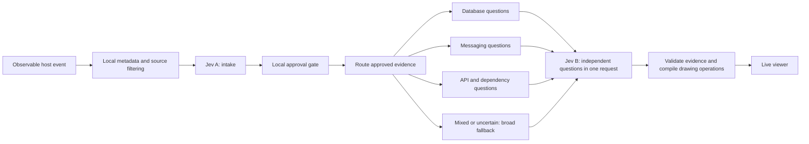

# Applying TypeSafe patterns to Graphlin

Reviewed against the official patterns index and its four linked pages on
19 September 2026. These are design decisions for Graphlin, not guarantees
made by TypeSafe.

## Intent routing

Intent routing is useful for choosing a visualization handler, evidence
context, and question priority. A single agent event may involve several
architectural domains. A primary intent must not silently discard secondary
work.

The current runtime labels activity in intake and asks a bounded set of
architecture questions. Domain routing is a proposed extension; it does not
yet prune questions or control drawing.

Routing can be included in the existing intake request. Questions in that
request are independent: a route answer cannot assume that the sensitivity
question approved its source. Code first applies the sensitivity and relevance
gates. Every question can see the request's whole state, including sibling
evidence. If filtering changes that state, discard the routing result and
use the broad fallback; a per-span question alone cannot prove that rejected
siblings had no influence. Bind usable routing to exact evidence, labels,
source versions, policy, model, and rubric.

Start with routing in observation mode: record its finite answer and compare
its recommended question priorities with the broad baseline, without dropping
questions. Candidate domains are database, messaging, API/network,
infrastructure, local code, mixed, and unknown.

Two possible representations have different tradeoffs:

- Four to six independent Noul questions over the bounded input support
  multiple simultaneous domains naturally. Six flags would make A's
  worst-case question count `1 + E + C + 6 = 31` at 12 entities and 12 spans.
  Use their results only when the entire routing input survives intake.
- One Choice per evidence span fits a smaller budget if it includes explicit
  `mixed` and `unknown` options. Both use the broad fallback. A Choice
  probability distribution is not a multi-label result.

When validated, routing may prioritize relation questions or select a bounded
context-enrichment plan. New context must pass intake itself; a routing
decision cannot grant permission to read or transmit it. File changes and
deletions continue to invalidate evidence regardless of the route.

## Speculative fan-out

Keep independent questions together. For a function and database binding,
ask about reads, writes, calls, and missing local implementation context in
the same architecture request. Code composes the answers afterward.

The current architecture request already follows this pattern. Intake and
architecture remain separate because architecture depends on the locally
approved evidence bundle. Joining those stages would remove that boundary.

The official pattern describes a latency advantage from parallel questions.
Graphlin still measures total latency, request/response sizes, and coverage:
the network and the two sequential stages consume time. Cheap inference is
not a reason to create unbounded pair combinations.

## Confidence-gated routing

For a Choice, check both the selected option and its confidence. For Noul,
use its probability; Noul has no separate confidence field.

Low routing confidence selects the broad fallback. Low architectural support
omits a claim; plausible but uncertain support can remain tentative. Missing
bindings or wrapper implementations veto an accepted relationship. A code
classification never certifies that a connection or write succeeded.

The implementation already checks support, role confidence, missing context,
accepted endpoints, source versions, and policy. Its numerical thresholds
are experimental and require evaluation on representative projects.

## Composite scoring

Composite scores could rank optional enrichment work, visual emphasis, or
question priority using separate signals such as relevance, novelty, and
context completeness. Keep the individual signals available for inspection.

Do not average away privacy, stale evidence, unsupported endpoints, or a
missing implementation. Those are independent gates. A weighted score is
not automatically a calibrated probability.

## Evaluation before enabling routing

Compare routing with the same broad baseline on mixed-domain changes,
unfamiliar APIs, mocks, unresolved wrappers, adversarial comments, and
evidence rejected by intake. Measure exact-pair relation coverage, wrong
routes, questions omitted, source sent, and cold/warm latency. Missing
questions count as coverage loss, not correct negative answers.

Only enable question pruning after this comparison demonstrates acceptable
coverage. The independent review recommends observation mode in the next
slice, then prioritization with a mixed/unknown fallback. The existing
best-pair fan-out already covers all six relationship types, so a routing
layer must demonstrate additional value before it reduces that coverage.

## Source material

- [Patterns index](https://docs.typesafe.ai/patterns.md)
- [Intent routing](https://docs.typesafe.ai/patterns/intent-routing.md)
- [Speculative fan-out](https://docs.typesafe.ai/patterns/fan-out.md)
- [Confidence-gated routing](https://docs.typesafe.ai/patterns/confidence-routing.md)
- [Composite scoring](https://docs.typesafe.ai/patterns/composite-scoring.md)
