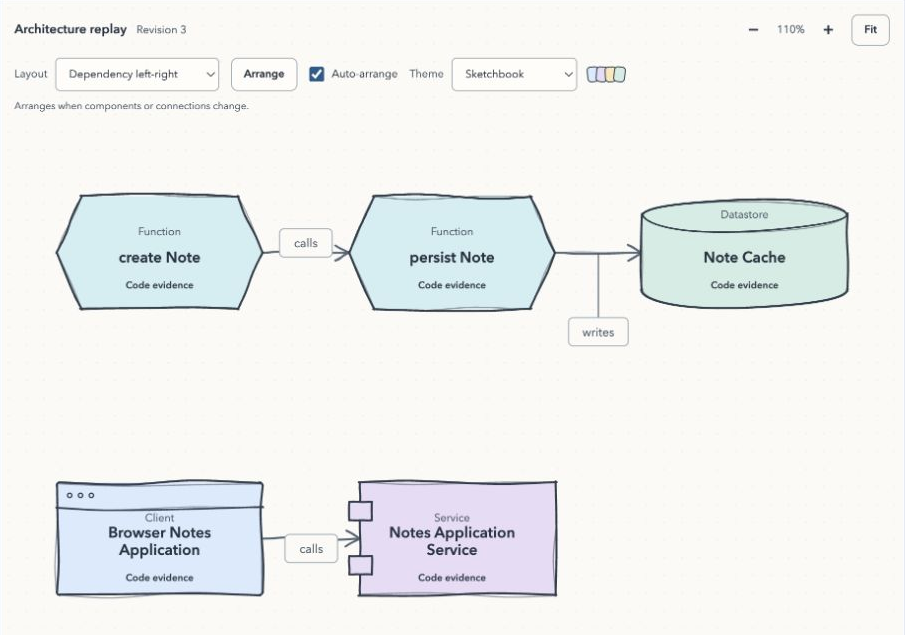

# Graphlin user guide

For your first run, follow the [two-step quick start](../README.md#get-started).

A local plugin for live architecture and activity diagrams while a coding agent works.



*A close-up from the offline demo. [See the full diagram](images/graphlin-overview.png).*

**Development preview.** Install from npm with the command below, or use a
checkout. Releases pass the full CI matrix; see [releasing](releasing.md) for
the publishing workflow.

## Guided setup

In your project's terminal:

```sh
npx --yes graphlin@latest
```

The first run detects host CLIs. If only one is available it selects that host;
otherwise choose **claude**, **codex**, or **both**. Choose **source** to permit locally filtered source excerpts, user
prompts, and public agent messages to reach TypeSafe, or **metadata** to work
without source transmission or an API key. Source mode offers a masked key
prompt when no key is available. Keys never belong in command arguments or chat.

Graphlin registers its local marketplaces and installs through the native host
CLIs for your user account. It preserves unrelated host configuration. Versioned
packages live under `~/.local/state/graphlin/plugins/graphlin/<version>`, outside
the npm cache. The viewer opens automatically and stays in the foreground;
**Ctrl+C** stops it. `--no-open` suppresses browser opening.

In a second terminal in the same project, run `claude` or `codex`. Accept the
project trust prompt. Confirm Graphlin is enabled using Claude's `/plugin`;
in Codex, use `/hooks` to review and trust Graphlin's hooks. Start a new host
session after installation. If using a custom data directory, copy the printed
agent command so the hooks inherit the same `GRAPHLIN_DATA_DIR`.

On subsequent runs, the bare command reuses saved setup. To configure without
starting a viewer, append `init`. A checkout can use
`node scripts/graphlin.mjs init`. Explicit `start` opens the viewer without
installing host plugins; omitted policy flags reuse current or saved consent.
`--no-source` explicitly opts out. A new project without consent is metadata only.

Consent belongs to the canonical project. The key and installed host list are
shared within the data directory. The key is kept in a private user settings
file (0600) in a private directory (0700), separate from evidence and exports.
Source-enabled `init` also saves an environment-provided key for later launches.
`TYPESAFE_API_KEY` overrides the saved key; an explicitly empty value disables
the saved key, so unset it to use the saved credential.

To replace an expired or incorrect saved key, run the npm command
with `init --replace-key`, or `node scripts/graphlin.mjs init --replace-key`
from a checkout. Replacement uses the masked terminal prompt; no command-line
key value is accepted. Restart the viewer to load the new key. Use `doctor`
to inspect setup and classifier state; it does not make a paid key-validation call.

Non-interactive commands never wait for Graphlin prompts. Specify a host and
source choice explicitly, for example:

```sh
npx --yes graphlin@latest init --host codex --no-source
```

A pending installation can resume from the bare command using already saved
project consent, including without a terminal. New projects still require an
explicit consent choice.

With `--allow-source`, a key must already be saved or supplied securely through
the environment. Use the interactive prompt to save a key. Missing CLIs,
cancelled setup, and failed host commands produce errors; each completed host
installation is recorded separately so a partial failure is visible. Installing
a plugin does not prove its hooks are active or its classifier key is valid.
Graphlin makes no key-validation request during setup.

Setup checks existing marketplace registrations before retrying. A name collision
with an unrelated `graphlin-local` marketplace is reported without replacing it.
Version upgrades update every recorded host, even when only one is selected,
so the shared version stays consistent. A failed upgrade retains the old version
until all hosts finish. If Codex's marketplace rebind fails after its old
registration was removed, it is recorded as pending rather than installed.
The next bare Graphlin run resumes unfinished hosts, including a partially
completed first installation. Existing keys and Graphlin history remain.

To reopen the viewer with a fresh one-use browser URL, use `graphlin open`
(or append `open` to the npm command). It starts a detached viewer
if needed. Use `graphlin stop` to stop it.

## Uninstall

```sh
npx --yes graphlin@latest uninstall
```

This removes Graphlin from the recorded hosts **for all projects**. Use
`--host claude`, `--host codex`, or `--host both` to choose explicitly, including
a manually installed Graphlin plugin. The native host CLIs remove only
`graphlin@graphlin-local`; unrelated plugins and settings remain intact.
Claude receives `--keep-data`. Keys, Graphlin history, generated packages, and
marketplace registrations remain for recovery or reinstall.

Uninstall resets source and evidence-persistence consent for the current
project. It does not change an already running viewer's active policy; stop it
with `graphlin stop`. Other projects retain their consent. A failed host removal
is reported and remains in the installation record.

The design uses Jev at two principal stages: **intelligent intake** (semantic normalization, contextual redaction, and candidate extraction) and **architecture decisions**. Focused code snippets go directly to Noul questions such as “does this function implement a database write?”, with optional Score evidence-strength diagnostics. Parsers help select context and resolve references; a library-specific semantic analyzer is not required for every relationship. A shared decision service can also support bounded alignment, grouping, enrichment, and contradiction checks. Local code owns privacy enforcement, evidence validity, precise drawing operations, and rendering.

## Try it

Requires Node.js 22.14+ on macOS or Linux. There are no package dependencies or
required build steps.

```sh
npm run demo
```

Open the local URL printed by the command. The demo uses synthetic source files
and recorded classifier answers; it makes no network API requests. It runs the
actual event normalization, evidence, decision, graph, and viewer components.
The command stays in your terminal. Press **Ctrl+C** to stop the service.
`start` behaves the same way; use `--background` only when you want it detached.

Starting again for the same canonical project and data directory reuses the
running service and port. A fresh one-use browser token does not mean a new
server. A foreground start can join an existing service; Ctrl+C stops that
joined service too. Separate projects or data directories have separate
services.

For your own project, explicitly start with metadata only:

```sh
node scripts/graphlin.mjs start --project /path/to/your/app --no-source
```

Source classification requires a TypeSafe key and explicit permission to
transmit sanitized excerpts:

```sh
node scripts/graphlin.mjs init --project /path/to/your/app
node scripts/graphlin.mjs start --project /path/to/your/app
```

Choose source mode and enter the key at the masked prompt. The key is read by
the daemon and never sent to the browser or inherited by installer/browser
subprocesses. Existing secure `TYPESAFE_API_KEY` environments are also supported.

Local filtering excludes credential/environment files, configured exclusions,
binary/oversized files, and obvious secret values before Jev sees anything.
Jev adds contextual filtering. Approved evidence is displayed by default;
use `--no-display-evidence` to hide it. Evidence persistence is a separate
opt-in, `--persist-evidence`. A policy change requires stopping and restarting
the daemon.

```sh
node scripts/graphlin.mjs doctor --project /path/to/your/app
node scripts/graphlin.mjs status --project /path/to/your/app
node scripts/graphlin.mjs export --project /path/to/your/app
node scripts/graphlin.mjs stop --project /path/to/your/app
```

State lives under `~/.local/state/graphlin` by default. Set
`GRAPHLIN_DATA_DIR` or use `--data-dir` to choose another location.
Source excerpts are ephemeral unless persistence is enabled. Retention and
payload sizes are bounded.

## Investigate a missing shape

Select **Classification log** in the viewer and search for a file, such as
`src/cache.ts`, or an entity name. The log connects file capture and candidate
selection to Jev's intake scores, role/relation decisions, and the final diagram
changes. It also explains work that never reaches Jev: duplicate events,
pre-tool intentions, withheld source, empty candidates, and capacity limits.

From another terminal:

```sh
node scripts/graphlin.mjs logs --project /path/to/your/app
node scripts/graphlin.mjs logs --project /path/to/your/app --file src/cache.ts
```

Logging is automatic. After updating Graphlin, stop the existing service with
**Ctrl+C** and run the same `start` command again. A running process cannot load
the new logger, and old classifier scores cannot be reconstructed.

Each classification records the effective thresholds, both request durations,
model/rubric versions, validated scores, and fixed rejection reasons. A successful
classification can still result in no change because source changed while it
was running, an entity is already current, or a drawing limit was reached.
The log distinguishes those outcomes from an API failure or timeout.

Logs contain no source bodies, prompts, credentials, launch tokens, or raw API
errors. Live file names and candidate labels follow the evidence-display setting;
persisted logs omit them unless `--persist-evidence` is enabled. The `--file`
filter also matches stable artifact IDs, including after a file is deleted.
The service prints its log location. Retention is bounded to a recent in-memory
window and two private JSONL files; logs remain separate from diagram exports.

## Plugin packages

Guided setup builds and installs these packages automatically. For development
or manual recovery:

```sh
npm run build
claude --plugin-dir ./dist/claude/graphlin
```

The build creates a `graphlin/` plugin inside `dist/portable`, `dist/claude`,
and `dist/codex`. Start
Graphlin for the project before working with the agent; passive hooks quietly
hand off events to the running service. A bundled MCP server also exposes
start, stop, status, and doctor controls.

The portable package uses Agent Plugins 1.0. Claude has its native manifest;
Codex has its portable extension and compatibility manifest. Kiro currently
has an experimental adapter profile. See [adapter coverage](../adapters/README.md).
Building a package does not install it into your host configuration.

The first implementation is Claude-first. Configuration and payload fixtures
are tested separately from real host activation. It does not claim universal
hook coverage or access to private reasoning.

## Connect an agent

In the live viewer, select **How to connect**. The guide shows copyable commands
using that service's project, data directory, and available plugin packages.
Its build step puts versioned plugins under the service's data directory, so
setup also works when Graphlin's installation folder is read-only.
Keep Graphlin running in its terminal and run the agent in another terminal.
The Jev key stays with the service; the agent commands do not include it.

After guided installation, simply start `claude` in the project. The manual
recovery guide can use `claude --plugin-dir` to load the built Claude profile.
The guide also shows how to resume a session with that profile.

The build includes a local Codex marketplace under `dist/codex`. From this
checkout, the setup commands are:

```sh
npm run build
codex plugin marketplace add "$PWD/dist/codex"
codex plugin add graphlin@graphlin-local
codex -C /path/to/your/app
```

Inside Codex, use `/hooks` to review and trust Graphlin's hooks. Start a new
session after installation. Building the marketplace only creates files;
the commands above register and install it when you run them.
If the service uses a custom data directory, use the guide's command so the
agent inherits the matching `GRAPHLIN_DATA_DIR`.

The command forms were checked against the installed CLIs and the official
[plugin packaging](https://developers.openai.com/plugins/build/plugins) and
[Codex hooks](https://developers.openai.com/codex/hooks) documentation.
Installation and hook trust still depend on your host configuration.

## Discover an existing project

Start Graphlin with `--allow-source`, connect Claude with the built plugin,
and ask it to **“orient yourself in this project”** or **“explore the architecture.”**
Completed reads, searches, and file listings can populate the diagram without
editing any files. There is no special prompt keyword or extra agent tool.

The existing `PostToolUse` hook supplies both the tool arguments and its result.
Graphlin recognizes returned file paths from Read, Glob, structured Grep results,
and common `find`, `rg --files`, and simple `ls` listings. It treats those paths as
hints and captures the current files from disk through the normal project and
privacy checks. Arbitrary shell output and an agent's summary do not become
confirmed source evidence. The hook never modifies Claude's tool result.

Classification runs asynchronously with two active workflows. Each receives its
own five-second deadline when it starts, so time waiting behind other file reads
does not consume that deadline. Queued source is checked again before
classification and before a result reaches the diagram. Work is deduplicated
within each session; another session can discover the same unchanged project.
The classification log records queue wait time and why work was skipped.

Discovery is bounded: the fallback directory scan visits at most 100 directories,
five levels deep, and selects up to 64 source files; explicit tool results can
identify additional files. The queue holds up to 64 waiting workflows for at most
two minutes. Excluded, unavailable, oversized, or sensitive files remain subject
to the existing evidence policy. A shape means code was observed; it does not
mean a database connection or other runtime operation succeeded.

Run `npm run eval:discovery` to replay a burst of orientation reads against real
Jev using a temporary, synthetic seven-file project. It reports per-file diagram
coverage, queue timing, and missing files. The probe uses `TYPESAFE_API_KEY` or
the local `.env.local`; it never reads your application or Claude transcript.

## Follow live work

A new Claude session automatically becomes the selected diagram when its
`SessionStart` hook arrives. Ordinary hooks, delayed classifications, and
background compaction from another session do not take the selection away.
You can still choose an older session manually.

Expand **Hooks received** in the sidebar to see individual hook receipts from
all sessions in this project, newest first. Pre-tool, post-tool, and repeated
deliveries remain separate. The feed holds up to 200 receipts in memory and
contains event metadata, not tool bodies, prompts, or credentials.

**Diagram changes** stacks miniature added, removed, and changed shapes, with
the latest revision at the top. Select a current shape to inspect its evidence,
or a removed shape to replay the preceding retained revision. History is bounded;
gaps and unavailable older revisions are identified. Theme, zoom, and layout
changes do not create architecture history.

Restart an older Graphlin service and reload the viewer to enable the detailed
hook feed. Receipts from before that restart cannot be reconstructed.

## Arrange the diagram

The diagram fills the workspace. Layout, theme, search, and type filters sit
above it. **Details**, **History**, and **Activity** open panels that are hidden
by default. Selecting a shape opens its evidence inspector.

The dashboard shows the active Git branch, full project path, and running
Graphlin version. Branch information refreshes every 30 seconds. The update
check asks npm only for Graphlin's public release metadata and caches the result
for 30 minutes. If a newer release is available, **How to update** provides a
copyable command that preserves this project's data directory. Stop the viewer
with **Ctrl+C**, run that command, and start a new agent session after setup.

Choose **Hierarchy**, **Dependency flow**, **Group by type**, **Circular**,
**Grid**, or **Original**. Auto-arrange responds to changes in the diagram;
turn it off to keep existing shapes in place, then use **Arrange** when ready.
Hierarchy follows the arrows and handles cycles; it does not imply ownership.

Scroll up over the diagram to zoom in around the pointer; scroll down to zoom
out. Drag the background to pan. **Fit**, layout switches, and **Arrange** show
the whole diagram, including below 50% for large hierarchies.

When a new shape arrives, the camera centers on it before its balloon animation.
A view below 50% zoom moves to 50%; a closer view keeps its zoom. If several
shapes arrive together, the last added shape gets the focus. Initial loads and
session switches show the whole diagram. Ordinary hook and status updates
preserve manual zoom and pan.

Type in the search box above the diagram, or press **/** to focus it. Search
matches any part of a node name, ignoring case, and shows only matching nodes
and connections between them. Each change rearranges the visible nodes and fits
them into the canvas, including clearing the search with **Esc**.

Type buttons show the component kinds present in the current diagram. Toggle
them individually, choose **All types**, or **Clear all** to start a new
selection. Search and type filters work together; Esc clears the search while
keeping the selected types. Filtering changes the view without deleting nodes
or changing exports.

Twelve component kinds map to distinct shapes, including functions, classes,
interfaces, events, configuration, packages, queues, and datastores.
Select a component to choose among 15 shapes in the inspector. Long names
wrap to two lines; the inspector retains the full name.

Shapes and arrows use **Tidy sketch** lines: gentle bends, close double strokes,
and slightly imperfect corners. The **Theme** selector offers
Sketchbook, Ocean, Forest, Sunset, Berry, Sepia, Blueprint dark, and Midnight
dark. Component kinds have coordinated fill colors; evidence labels and line
patterns remain distinct in every theme. Themes apply to the diagram and its
controls, leaving the evidence inspector readable in the surrounding interface.

New components inflate with a small bounce. Removed components pop into
particles. Replay, initial loading, reconnection, and stale evidence do not
trigger these effects. Reduced-motion preferences are respected.

Layouts and shape overrides affect the view only. They do not change evidence,
classification, recorded coordinates, or exported graphs. View preferences
are kept in memory per project/session/replay view and reset on page refresh.

## Test

The following development and evaluation commands require a source checkout.
They are not part of the installed runtime package.

```sh
npm test
```

The automated suite uses local fixtures and injected transports. It checks
privacy, the A-to-B boundary, HTTP response validation, deadlines, event
correlation, source-version invalidation, graph integrity, replay, local
authentication, packaging, and viewer behavior.

An explicit live evaluation calls Jev with synthetic code cases:

```sh
npm run eval:jev
node scripts/evaluate-jev.mjs --repeat 3
```

This command reads `TYPESAFE_API_KEY`, optionally from `.env.local`, and saves
a numeric report in the ignored `.graphlin/` directory. It never sends your
project source. It reports missing candidates/questions and timeouts as
inconclusive. The default request cap is 128; explicit repeats keep their
earlier failures in the report. These examples are a smoke evaluation, not a
calibrated benchmark. See [live findings](jev-integration-findings.md).

The implementation uses JavaScript ES modules on Node.js, with HTML, CSS,
and JavaScript in the viewer. TypeSafe provides an official JavaScript/TypeScript
SDK, `@typesafe-ai/sdk`. This first slice uses the documented HTTP API through
Node's built-in `fetch`, keeping installation dependency-free while controlling
the complete request deadline, response bounds, and retry policy.

## Evidence and limits

- Jev interprets focused snippets. A classified write path does not prove a
  live database connection or a successful write.
- Pre-tool events show pending activity; they cannot confirm future changes.
- File observations have their own versions and unknown authorship. Changes
  invalidate dependent claims across sessions even when Jev is unavailable.
- Restored claims start stale until fresh authorized observations support them.
- Streaming message assembly, semantic alias merging, broad static analysis,
  account-wide budgets, and Windows transport are outside this first slice.
- Request budgets are per daemon. Classification can pause while metadata and
  evidence invalidation continue.

## Design and review

- [Proposed design](graphlin-design.md): architecture, plugin packaging, host coverage, Jev requests, state, drawing language, failure behavior, and delivery plan.
- [Interactive walkthrough](graphlin-design.html): replay a build, failed check, later verification, component removal, and Jev outage; inspect the two-stage pipeline.
- [Independent review](graphlin-review.md): prioritized findings and follow-up status.
- [Research coverage](research-coverage.md): primary documentation and design decisions.
- [Implementation plan](implementation-plan.md) and [module contracts](module-contracts.md).
- [Preimplementation review](implementation-review.md).
- [Implementation validation](implementation-validation.md): code review,
  automated tests, browser checks, and remaining scope.
- [Jev patterns](jev-patterns.md): intent routing, speculative fan-out,
  confidence gates, and evaluation before enabling domain routing.

Open the HTML file directly in a browser, or serve `docs/` with a local static web server. The walkthrough is self-contained and makes no network API calls.

The design walkthrough remains illustrative. The live viewer is served by the
runtime started through the commands above.

## Contributing and license

See [CONTRIBUTING.md](../CONTRIBUTING.md) for development and review guidance,
[SECURITY.md](../SECURITY.md) for vulnerability reporting, and
[the release guide](releasing.md) for npm publishing.
Graphlin is available under the [MIT license](../LICENSE).
