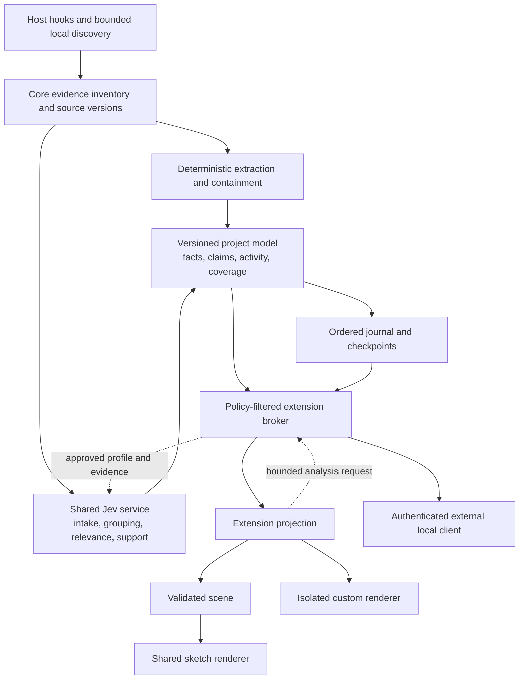

# Graphlin visualizer platform: implementation and orchestration plan

Status: M0–M5 implemented; integration review and release verification in progress.

Date: 20 September 2026. Baseline: Graphlin 0.1.3, commit `2b398df`.

The user approved the direction and delivery sequence in the design discussion.
This document turns that direction into implementation work, review gates, and
acceptance criteria. It supersedes the original MVP plan for the discovery,
semantic-model, and visualization work described here. Existing capture,
privacy, and evidence-correctness contracts remain in force.

## At a glance

| Milestone | Reviewable result | Depends on |
| --- | --- | --- |
| M0 | Frozen contracts, parser/isolation spikes, migration proof | This reviewed plan |
| M1 | Source-first model, fair discovery, local structure, scoped snapshots | M0 |
| M2 | Extension host and current viewer extracted as an extension | M1 |
| M3 | Nested blocks, C4, and task-change views | M2 |
| M4 | Custom activity timeline, resumable transport, external read API | M2; integration after M3 |
| M5 | Author SDK, install/update/remove, npm packaging and release checks | M3 and M4 |

The first execution wave is M0: the coordinator freezes shared contracts while
independent workers validate parser packaging and browser isolation. Subsequent
workers receive disjoint file ownership and acceptance IDs from this plan.

The central design changes are a source-first model with visible coverage,
separate visible-scene budgets, stable identities across sessions and views,
core-owned decisions, and explicitly granted extension access. The plan has
40 acceptance scenarios. The implementation contracts are documented in
[decision-service.md](decision-service.md), [model-api.md](model-api.md),
[extension-authoring.md](extension-authoring.md), and
[visualizer-views.md](visualizer-views.md).

The approved scope includes every milestone. The decision service is provider
independent: Jev supplies the initial adapter. Providers return validated typed
answers; the core owns source consent, filtering, budgets, caching, evidence
freshness, and interpretation admission. Extensions never receive provider keys.

## 1. Outcome and scope

Graphlin will build a useful, source-driven map without architecture documents.
One installed agent integration will feed multiple visualizer extensions. Users
will be able to view the same project as code, nested building blocks, C4,
changes, or activity, and to follow agent work within those views.

The end-to-end acceptance scenario is:

> An extension author builds a C4 visualizer outside Graphlin's source tree,
> installs it locally or from a packaged release, selects it in the dashboard,
> and receives live, inspectable, replayable updates without changing a host
> adapter, obtaining an API key, or implementing another collector.

The four agreed delivery steps are:

1. Separate the evidence model from the canvas, and improve discovery.
2. Make the current viewer the first extension.
3. Add nested building blocks and C4, then a custom activity timeline.
4. Deliver the extension authoring, installation, and external local API paths.

This is a platform refactor delivered in working increments, not a simultaneous
rewrite. The current viewer remains available throughout migration.

### User questions the design must answer

| Question | Product behavior |
| --- | --- |
| What is this project made of? | Useful landmarks before a long list of symbols; progressive expansion |
| Where is the agent working? | Activity attached to the application, component, module, or symbol |
| What did it discover? | Newly discovered existing structures distinguished from new code |
| What changed in this task? | Changes against an explicit baseline, with evidence |
| What could be affected? | Supported relationships and their rolled-up boundaries |
| How certain is this picture? | Basis, freshness, unresolved relationships, and discovery coverage |
| Can I explore without losing my place? | Stable selection, breadcrumbs, optional follow mode, preserved replay position |

### Included

- Project/worktree evidence inventory independent of visible-node limits.
- Explicit source containment; separate architectural membership and hosting.
- Hierarchical views, cross-boundary connections, scoped filtering and search.
- Jev-based grouping and relevance behind a shared, policy-enforcing service.
- A versioned extension manifest, input contract, scene contract, and lifecycle.
- Shared sketch rendering and an isolated custom-renderer path.
- Existing code view, nested blocks, C4, task changes, and an activity timeline.
- Authenticated, read-only external local consumers of the same model.
- Local development, package validation, installation, compatibility checks,
  author documentation, and synthetic replay fixtures.

### Deferred

- An extension marketplace, cloud hosting, collaboration, or a landing page.
- Third-party code executing inside the daemon, custom credential providers,
  arbitrary filesystem access, and third-party collectors.
- Automatic deployment tracing or runtime instrumentation. The model will
  accept correctly attributed runtime evidence later; source alone never
  establishes that execution occurred.
- Complete call graphs or architectural understanding for every language.
- Automatic code changes to enforce an inferred architecture.
- A repository-wide, unlimited source index or unbounded classifier workload.

## 2. Decisions that carry through every milestone

1. Architecture documentation is optional evidence. Missing documents must not
   weaken the normal onboarding path. A document cannot override newer source
   evidence, and a recent file timestamp is not proof of correctness.
2. Hooks remain passive, bounded, and fail open. Neither parsing, projection,
   extension startup, nor a Jev request runs in the synchronous hook path.
3. Code observations, architectural interpretations, public intentions, and
   runtime observations remain distinguishable. No private reasoning capture.
4. The daemon owns identity, evidence versions, policy, journal ordering, and
   accepted model changes. Extensions cannot mutate those records directly.
5. Presentation never supplies truth. A renderer's cylinder does not make a
   binding a database, and a moving arrow does not prove execution.
6. Code containment, responsibility grouping, and runtime hosting are different
   relationships. One global parent pointer cannot represent all three.
7. Jev selects among bounded, supplied alternatives. Core constructs identifiers,
   exact labels, evidence references, and accepted mutations.
8. No extension receives the API key, viewer session cookie, raw hook body,
   transcript, absolute filesystem locator, or unrestricted source retrieval.
9. New capabilities do not silently widen existing source, display, persistence,
   or network consent.
10. The Graphlin extension API is our own versioned contract. It is separate
    from the Claude/Codex agent-plugin formats and does not imply a universal
    visualizer standard or new host certification.

## 3. Current implementation and the required seams

| Current location | Existing responsibility | Planned treatment |
| --- | --- | --- |
| `runtime/collector/`, `adapters/`, host manifests | Passive host capture | Preserve contract; no visualizer-specific hooks |
| `runtime/pipeline.mjs` | Capture, scheduling, interpretation, graph integration, sessions | Coordinator-owned migration into model/journal orchestration |
| `runtime/core/evidence.mjs` | Worktree-scoped artifacts and freshness | Preserve authority; add inventory and parser provenance |
| `runtime/core/lexical.mjs`, `candidates.mjs` | Bounded lexical candidates and relation hints | Keep fallback; introduce explicit parser capability levels |
| `runtime/core/common.mjs`, `graph.mjs` | Roles, finite graph, admission and reducer | Separate semantic records from the legacy render graph |
| `runtime/jev/` | A/B calls, approved bundles, validation, limits | Preserve; add bounded semantic profiles and shared scheduling |
| `runtime/daemon/` | Auth, IPC, HTTP/SSE, persistence, diagnostics | Add versioned scoped model access and external grants |
| `runtime/web/app.js` | Viewer state, interactions, rendering, replay | Extract host shell, extension lifecycle, shared interaction adapters |
| `runtime/web/layout.js`, `sketch.js`, `sidebar.js` | Presentation algorithms and UI | Reuse; extend group geometry and scene mapping |
| `schemas/`, `docs/module-contracts.md` | MVP wire contracts | Retain v1; add separately versioned model and extension contracts |
| Package/build/validation scripts | Explicit bundled-file allowlists and host packages | Include SDK/runtime assets and verify installed extensions |

The existing graph has a 256-node limit, 768-edge limit, and serialized-byte
limits. Candidate generation and relation proposals are also bounded. Merely
raising a canvas limit, hiding imports, or adding group shapes does not separate
discovery capacity from display capacity.

Review also identified earlier limits: automatic discovery repeatedly starts
from the first 64 files, within 100 directories and depth 5; background capture
uses its first 32 paths; artifact tracking stops at 1,024 paths. Lexical
extraction samples bounded windows before ranking candidates. A completed
classification can be remembered even when graph admission rejected it. Each
of these limits needs resumable coverage or explicit deferral, not just a larger
final graph.

Today metadata mode can read/hash eligible files while withholding their text.
The proposed stricter metadata mode below deliberately removes that content
reading; it is not a description of current behavior.

In the KiroCrew orientation case, the current map reached 256 nodes from 23
tooling files, with 8 relationships; subsequent admissions reported
`node_limit`. These aggregate observations motivate a synthetic regression
fixture. Private project source, transcripts, state, identifiers, and paths
must not enter the repository.

## 4. Architecture and ownership of decisions



Interpretations are reusable model records, scoped to their producer/profile.
Projections are view-local selections, groupings, and relationship aggregations.
Rendering turns a projection into pixels. Layout does not call Jev.

A browser disconnect must not stop capture or authorized shared analysis.
Extension broker work is bounded and independent of daemon ingestion and the
coding agent. Browser responsiveness and recovery are M0 test gates; an iframe
is not a promise of hard cross-extension CPU or memory isolation.

## 5. Model v2

### Records

| Record | Required meaning |
| --- | --- |
| Artifact | Opaque worktree identity; content version; capture status; authorized display metadata; extractor capability |
| Entity | Identity independent of drawing; declaration/resource kind; references to current evidence |
| Structural relation | Parsed containment, supported import/reference, or other precisely defined relation |
| Interpretation | Producer/profile; proposed responsibility, membership, layer or architecture role; support and contrary evidence |
| Evidence | Artifact version/span or observed event; method; completeness; approval and policy provenance |
| Activity | Session/agent/tool correlation, attempt/outcome, time, and attribution strength |
| Change set | Comparison against a named checkpoint; additions, modifications, removals, invalidations and discoveries |
| Coverage | Inventoried, inspected, deferred, excluded, unsupported, unavailable, or truncated scope |
| Checkpoint | Model revision, journal position, project/worktree lineage, and evidence/interpretation versions |

Do not put coordinates, shapes, colors, collapsed state, camera position, or
extension-specific node IDs on the canonical entity.

### Identity and containment

- Keep entity identity separate from artifact content versions. Body edits must
  not replace an otherwise identifiable declaration.
- Use language, artifact identity, qualified lexical scope, declaration kind,
  and a disambiguator when necessary. Two methods called `run` in different
  classes must not collapse into one symbol.
- Do not infer a cross-file rename solely from a matching label. Record
  supported aliases/moves explicitly; ambiguous matches remain separate.
- Imported references and declarations are different records. Resolve imports
  to canonical project/package identities only with adequate resolver evidence.
  Standard-library references should not produce a new top-level node per file.
- Parsed containment forms an acyclic forest within its code scope. Validate
  parent existence, source-span enclosure, and cycles. Incomplete parsing cannot
  assert ownership it did not establish.
- Architectural membership belongs to a named interpretation namespace. An
  entity can participate in a responsibility group and a layer without either
  becoming its code parent.
- Runtime hosting is independent. Multiple logical sessions can share a
  process; a class named `Worker` is not proof of a deployed worker process.
- A projection group has stable extension-scoped identity and a membership
  reference. Large membership sets are paged; they are not duplicated into
  every rendered node.
- On parent disappearance, invalidate membership supported by that parent.
  Reparent a child only when its current evidence establishes the new owner;
  otherwise keep it reachable under an unresolved scope. Do not delete a
  surviving child just because a presentation group disappeared.

### Evidence state and invalidation

Preserve separate dimensions for:

- Basis: parsed source, Jev interpretation, documentation, explicit user
  annotation, or instrumented/runtime observation.
- Support: supported, tentative, unknown, or contradicted.
- Freshness: current, stale, or retracted.
- Completeness: complete capture, partial capture, unavailable, or excluded.

A missed scan is not a deletion. Confirmed absence retracts support; partial or
unavailable reads make relevant claims stale. Evidence updates and acceptance of
asynchronous decisions are serialized. Late results cannot revive old versions.

A grouping becomes stale when its supporting inputs change. Unrelated groups
should retain identity and layout. A rejected claim is not silently converted
to an accepted negative claim. Missing probabilities are not zero probabilities.

Complete declaration enumeration for a current file/scope can establish that
a formerly present symbol disappeared. Budgeted candidate omission, a partial
parse, or incomplete inspection cannot. Maintain dependency indexes so changes
invalidate affected containment, claims and aggregate edges transitively,
without rereading the entire inventory for every result.

An enumeration certificate binds artifact hash/generation, enumerated scope,
extractor/grammar version, identity scheme, covered ranges, and omission flags.
A changed parser or identity scheme triggers reconciliation; it must not report
unchanged source as deleted code. “Created since baseline” requires supported
prior absence or an observed creation correlated with current source. Incomplete
baseline coverage yields “newly discovered,” not “newly created.”

Documentation, including code fences inside it, remains document evidence.
Reading a plausible document successfully cannot establish source containment,
declarations in an application artifact, or runtime behavior. Document-only
structure can appear as an attributed provisional interpretation until supported
by other evidence; prose is never routed through the source-fact parser as code.

### Project, session, branch, and time

The structural inventory belongs to the canonical worktree, with explicit
lineage. Sessions supply activity and observations over that structure. A new
agent session changes the activity focus without inventing a new empty project.

History views use a frozen checkpoint, including its interpretation versions.
They must not combine old code with today's grouping answers. A task baseline is
an explicit recorded marker or user-selected checkpoint; the UI may default to
session start. Do not assume every message starts a new task.

Branch/HEAD changes trigger lineage reconciliation and freshness checks. File
watcher changes retain unknown authorship unless correlated with an observed
tool outcome. A tool that read a file supports “read,” not “understood.”

Session selection, replay, and view state become client-local. One viewer must
not change another viewer's selected session. A clearly labelled live activity
feed may coexist with a historical architecture view; each feed carries its own
cutoff. The timeline explicitly chooses live time or a historical cutoff.

Record lifecycle observations append-only, including attempted and completed
tool calls. Derive the current coalesced activity row from those observations;
do not discard attempt timestamps needed to reproduce a timeline. Distinguish
source/event time from the journal position at which a result became known.

## 6. Discovery that does not depend on documentation

### Bootstrap and progressive exploration

1. Enumerate a bounded metadata inventory using the existing canonical-root and
   exclusion protections. Do not execute repository code or build tools.
2. Identify candidate roots from authorized names/stat metadata and directory
   structure. Only after local-read permission is established, inspect
   package/workspace manifest contents and entry-point configuration. Treat
   these as packaging evidence, not automatic proof of deployment. Reading
   architecture documentation also requires that local-read permission.
3. Allocate inspection across product roots, tooling, tests, packaging, and
   other discovered areas. Use round-robin coverage before allowing one root
   to exhaust symbol or classification budgets.
4. Under an explicit source-reading policy, parse entry points and representative
   modules. Add source containment, declarations, and resolvable local imports.
5. Prioritize agent-touched files and their bounded neighbours. Background work
   yields to relevant live changes while retaining a starvation-prevention quota.
6. Ask Jev for supported responsibilities and membership using bounded candidate
   groups. Show file/module structure while those answers are absent.
7. Expand detail on demand. Follow relationships through bounded additional
   reads; surface unresolved or deferred edges instead of fabricating endpoints.
8. Treat documentation as another attributed input if present. Test the entire
   process with no documentation and with deliberately misleading documentation.

Enumeration retains a continuation cursor across batches. Bound directory
entries visited, depth, bytes read, extraction windows, queue length, and elapsed
work per slice; report which bound caused a deferral. Repeated scans progress
beyond the first 64 files and beyond the first source windows. Live-task priority
must not permanently starve background roots.

Track inspection, classification, semantic admission, and view inclusion as
separate states. A classified-but-deferred entity can be admitted later without
a source edit or another equivalent Jev request while its decision and approval
remain retained and valid. If they expire or are evicted, report “requires
reassessment” and schedule bounded recapture/intake as needed; never leave it
permanently “completed.” Reserve summaries/root capacity before admitting
expanded symbols.

Resolve cross-file relationships through a bounded context assembler in core.
Select the relevant declaration, import/binding, wrapper and target evidence;
run every snippet through the same mandatory approval path. Classify only the
stated relation whose supporting context is present. Track relationship
coverage separately from entity coverage. If a relation needs more references
than a record can carry, use an indexed evidence set or explicit deferral;
never truncate required support while claiming the relationship is established.

Initial source readers target JavaScript/TypeScript/TSX and Python because they
exercise both Graphlin and the motivating project shape. Other languages retain
the lexical/file-level fallback with visible capability limits.

M0 must validate a pinned, offline parser packaging approach. The preferred
spike is WASM-backed grammars; evaluate parser correctness, package size, bounded
resource use, and Node 22/24/26 support on macOS/Linux. Never execute a project's
installed parser, Python module, or configuration to discover structure. A
lexical guess must not be labelled a parsed ownership fact.

### Consent and no-key operation

Keep metadata-only users in a restricted mode. Tighten that mode to avoid file
content reads/hashes; capture authorized filesystem/event metadata only. Add an
explicit **Local structure** choice that permits local source analysis without
transmission. Existing
`--allow-source` remains the explicitly consented remote-classification path.
Do not reinterpret an old metadata-only setting as permission to read source.

The model must distinguish local read, remote transmission, display, and
persistence permission. Local parsing passes through local filtering and the
display policy; it cannot become an indirect route to source transmission.
Raw snippets remain ephemeral unless the existing evidence-persistence policy
explicitly permits their storage.

No key, unavailable Jev, or refused transmission still permits a useful view at
the user's authorized level. Metadata mode shows metadata/activity; Local
structure shows deterministic structure. Neither pretends to have semantic
classifications that were never made.

### Separate budgets

The initial engineering targets below are proposed caps to benchmark in M0,
not claims about current behavior or measured performance.

| Resource | Initial target and behavior |
| --- | --- |
| Metadata inventory | 10,000 paths; visible deferred counts beyond the bound |
| Hot model | 20,000 entities, 40,000 relations, 32 MiB serialized soft cap, 48 MiB hard cap; all bounds apply |
| Active source reads | Keep current 256 KiB/file cap; batch and yield between files |
| Jev | Preserve current A/B byte/question/deadline limits; shared bounded scheduler |
| Reusable decision cache | Initially 512 entries/8 MiB plus up to 4 MiB of indexed evidence metadata, counted inside the hot-model budget |
| Extension analysis requests | Deduplicate; cap outstanding work per extension; lower priority than live evidence invalidation |
| Model page | At most 200 records and 512 KiB; reject/trim before transport |
| Default scene | Up to 256 visible items and 768 links within existing byte limits |
| Render/update work | Budgeted per extension; cancel obsolete projections; keep last valid frame |
| History | Bounded checkpoints plus deltas; explicit oldest available position |

Maintain an acyclic, internally consistent retained model when a cap is reached.
Eviction or deferred inspection is a coverage change, not source deletion.
Persist compact structural metadata under the applicable policy, not an
unbounded cache of source. Requests for detail can recapture authorized evidence.

A dataset larger than the hot model must remain explorable in bounded scopes.
Root summaries and coverage counts cannot depend on every child being retained.
The node limit of one view must never halt discovery of all other roots.

### KiroCrew-shaped acceptance fixture

Create an original synthetic workspace with a Python gateway, a web surface,
session management, context/memory, scheduling, security, and extensive tooling.
Put enough tooling early in enumeration to reproduce the previous starvation
pattern. Supply variants with no docs, correct docs, and conflicting docs.

At bootstrap, each application/root must become reachable in the structure view
before all helper symbols are expanded. Tooling must remain useful when the task
is about test workers. A broad import inventory must not drown out first-party
responsibilities. No fixture copies KiroCrew implementation or user state.

## 7. Shared Jev analysis

Keep the existing A/B privacy boundary and typed response validation. New
analysis does not get a separate endpoint, credential path, or privacy bypass.

| Decision family | Bounded inputs | Accepted output |
| --- | --- | --- |
| Exploration intent | Approved public request and observable event metadata | Known task category or unknown |
| Project-area classification | Authorized manifest/file metadata and approved snippets | Runtime, tooling, tests, packaging, or unknown |
| Responsibility/membership | Current entity evidence and supplied group candidates | Candidate IDs, typed support, ambiguity |
| Architectural role/layer | Source evidence and a named taxonomy | Known role/layer or unknown |
| Boundary relation | Supported endpoints and exact approved evidence | Typed support for the stated relation |
| View relevance | Task scope and existing evidence-backed entities | Ranking among supplied alternatives |
| Documentation conflict | Attributed document claim and current approved source | Support, contradiction, or insufficient evidence |

Labels come from validated source names, supplied taxonomy labels, user
annotations, or attributed document text. Jev does not invent authoritative
component names or emit drawing operations.

### Context, stages, and cache

- Use named structured state: task context, evidence, entities, candidate groups,
  neighbouring relations, taxonomy/profile, and explicit coverage limitations.
- Reference the actual bounded state paths in questions. Keep internal IDs and
  correlation bookkeeping local when they do not aid the decision.
- Batch independent questions. Hierarchical decisions that require earlier
  answers use another bounded stage; questions in one request cannot assume
  access to another answer in that request.
- Back off to a supported broader group when finer placement is uncertain.
  Uncertainty must not force a leaf classification.
- Cache by project/worktree lineage, exact input versions, policy version,
  model, profile/question version, taxonomy, and relevant task scope.
- Reuse approval only for the same immutable, still-current evidence and policy.
  New source or changed policy goes through intake again.
- Bound decision and evidence-index caches by both count and bytes. Before
  deferred admission, revalidate every required version and approval. Retained
  live bundles remain internal capabilities; serializing their fields does not
  preserve approval authority. Persist neither snippets nor approvals beyond
  the existing policy; a restored/evicted capability requires fresh approval.
- Extension changes, browser refreshes, pan/zoom, layout and themes do not
  resubmit equivalent requests. Multiple viewers share decisions.
- Profile activation is an explicit host operation under an approved grant,
  independent of renderer mounting. Projection execution is pure and cannot
  hide a classification request as a rendering side effect. A missing-analysis
  response can offer a host-owned enable action; switching views and replay
  never activate analysis implicitly.
- Frame requests and daemon analysis subscriptions have different owners.
  Frame disposal cancels its pages/projections and detaches its waiters.
  Authorized project/profile subscriptions and jobs shared by other owners
  continue. Disable/removal/revocation removes the relevant analysis owner;
  cancel a job when no authorized owner remains, or when its evidence/policy
  becomes invalid.
- Keep selection, rendering, and hooks responsive during outages. Missing
  analysis yields structural fallbacks and explicit uncertainty.

Extensions register declarative decision profiles, not executable server-side
callbacks. The host validates profile schemas, allowed answer types, state
selectors, questions, and budgets. Requests name existing evidence IDs; arbitrary
paths, URLs, snippets, raw prompts, thresholds, or credentials are not accepted
from an extension.

## 8. Visualizer API v1

Model schema version, model transport version, extension API version, scene
schema version, and package version are separate identifiers. Compatibility is
checked before code loads.

### Package contents

An extension includes a manifest, a bundled browser entry, optional declarative
decision profiles, and either shared-scene output or a custom renderer. The
first release requires self-contained assets; it does not resolve dynamic
runtime dependencies or remote scripts.

Illustrative manifest; M0 freezes the exact schema before implementation:

```json
{
  "id": "example.c4",
  "version": "0.1.0",
  "manifestVersion": 1,
  "graphlinApi": "1",
  "modelSchema": "2",
  "requiredFeatures": ["containment", "scoped-membership"],
  "entry": "./dist/visualizer.js",
  "views": ["context", "applications", "components"],
  "renderer": { "kind": "graphlin-scene", "sceneVersion": "1" },
  "decisionProfiles": ["./profiles/c4.json"],
  "capabilities": [
    "model.read",
    "activity.read",
    "analysis.request",
    "selection.request"
  ]
}
```

### Host and extension contract

| Direction | Contract |
| --- | --- |
| Host → extension | Initialize with negotiated versions, granted capabilities, policy-projected scope and settings |
| Host → extension | Consistent snapshot/pages followed by ordered deltas |
| Host → extension | Scope, task baseline, selection, replay, theme, and viewport changes |
| Extension → host | Validated scene or bounded custom-view status |
| Extension → host | Request paged children/neighbours within granted scope |
| Extension → host | Request approved analysis profile against existing evidence IDs |
| Extension → host | Request selection, evidence inspection, or an allowed scope change |
| Both | Cancellation, readiness, errors, teardown, and bounded diagnostic metrics |

Every asynchronous request/response carries extension instance, project lineage,
model revision, view epoch, request ID, and negotiated API version. The host
rejects results for obsolete scopes, replay positions, policies, or instances.
Manifests also identify exact asset hashes and supported profile/scene versions.
Unknown required features fail closed.

Projection must be deterministic for the same input, extension/profile version,
and settings. Random drawing variation uses stable seeds. The projection maps
render IDs back to canonical entities, relations, or aggregate membership.

A custom renderer must implement accessibility, keyboard navigation, selection
mapping, teardown, and declared host controls. Unsupported capabilities are
hidden or explained; the host must not pretend a timeline supports graph layout.

### Shared scene

Extend the existing finite primitives with validated groups, containment bounds,
ports/anchors, and aggregate relationship references. Scene fields include
stable render IDs, canonical mappings, labels, styles from approved tokens,
optional layout hints, and a coverage summary.

The host owns layout execution and validates coordinates, cycles, endpoint
existence, sizes, item counts, text, and serialized bytes. Extensions do not
inject SVG/HTML into the shared renderer.

Collapsed groups aggregate boundary-crossing relationships by endpoint scope
and relation type. Preserve counts and access to member evidence. Internal
relationships stay inside the collapsed group; they do not become misleading
self-arrows. Do not merge reads, writes, and calls into a stronger relation.

### Execution and data boundary

- Projection code and custom UI run in an opaque-origin sandboxed browser
  frame, not in the daemon. A Node worker or `vm` is not a security boundary.
- Use a dedicated asset origin, a restrictive CSP, no same-origin, popup,
  top-navigation, form, or download grants, and a host-initiated MessageChannel.
  Apply sandbox/CSP restrictions in response headers as well as frame attributes
  so opening the frame document directly does not remove its restrictions.
  Validate the expected frame window and one-use nonce before transferring the
  port; `origin === "null"` alone never authenticates an extension.
- Bind approval to project, extension ID, bundle digest, permitted fields,
  analysis profiles, and history access. Effective access is the intersection
  of current core policy and that grant. Denied approval means no data delivery.
  Revoke ports and cancel frame-owned work on navigation, replacement, disposal,
  or grant change. Reevaluate ownership of shared analysis separately. Reapply
  current disclosure policy to history and cached results.
- Core serves only installed, validated asset paths. Reject traversal, escaping
  links, oversized files, remote asset references, and unsupported manifests.
- The broker grants only policy-projected model data. API v1 third-party grants
  cannot include raw source, snippets, evidence excerpts, prompts, or transcripts
  through any page, namespace, history, diagnostic, or inspection response.
  The host inspector alone displays authorized excerpts. Any first-party
  privilege beyond this ceiling must be separately identified and reviewed.
- Limit message count, payload bytes, outstanding pages, analysis jobs, and
  projection time. On failure, retain the last valid view and expose recovery.
  Revocation or policy tightening overrides that fallback: clear affected
  host-owned scenes, purge controlled caches, destroy/restrict the frame, and
  stop future delivery. Do not retain revoked content as a “last valid” view.
- Third-party visualizers are code chosen by the user and can read the data
  granted to them. Browser isolation and CSP are not a universal guarantee
  against disclosure, including frame self-navigation. Installation must make
  this data access explicit; there is no claim of arbitrary-code zero-egress.
  Revocation stops future delivery but cannot recall data an extension copied.
- The initial public contract grants no general network capability and no
  automatic capability expansion on update. Custom rendering ships only after
  its isolation tests pass; shared-scene extensions remain usable independently.

The security review must verify actual browser behavior, not infer safety from
the presence of an iframe attribute. If a desired isolation property cannot be
enforced across supported browsers, reduce the grant or defer that capability.

## 9. Viewer behavior and reference extensions

### Host shell

Keep the compact, canvas-first UI and hidden-by-default Details, History, and
Activity panels. Add a view selector and relevant scope controls without
restoring the old large control panels.

Shared state includes selected project/session, checkpoint or live position,
task baseline, selected canonical entity, and optional follow mode. Store
extension-specific depth, grouping, and camera settings separately.

- Switching views tries the same entity, then its nearest represented ancestor.
- Expanding a group preserves location and reveals its code or component detail.
- Search and type filters arrange and fit results, preserving ancestor frames
  or breadcrumbs so matches remain situated.
- Escape clears search while retaining selected type filters, as today.
- Follow mode reveals the active area. With it off, updates do not steal the
  camera. Arrival focus and balloon effects apply to graph views through the
  shared renderer; discovery and code creation have different labels/styles.
- A collapsed group reports activity and change counts without opening every
  child. Multiple agents appear as attributed overlays only when supported.
- Selection/evidence/replay works across both shared and custom views.
- Every view shows coverage limits; a healthy connection is not complete
  discovery, semantic certainty, or runtime verification.

### Reference views

| View | Default interpretation | Specific acceptance requirement |
| --- | --- | --- |
| Existing code map | Current node/edge presentation over the new model | Preserve themes, style D, filtering, focus, exports and evidence |
| Nested building blocks | Responsibility groups with source ownership drill-down | Nested groups, rolled-up edges, unknown groups, stable expansion |
| C4 | Context, applications/datastores, components, code drill-down | No automatic class→component or package→deployment conversion |
| Changes | Structural view compared with explicit baseline | Distinguish discovered-existing, created, modified, removed and invalidated |
| Activity timeline | Ordered agent/tool observations and outcomes | Works without a graph; distinguishes parallel work and missing outcomes |

C4 actors and external systems require evidence or an explicitly attributed
annotation. “Container” receives an explanatory application/datastore label.
Unsupported details remain unknown; the extension does not invent familiar
architecture boxes to complete a picture.

The custom timeline proves that the platform is not tied to rectangles and
arrows. A later sequence visualizer may show inferred code collaboration or
observed execution, with those modes clearly separated.

## 10. Transport, persistence, and migration

### Versioned local access

Retain `/api/state`, legacy exports, and current SSE behavior until compatibility
fixtures prove migration. Add an explicitly versioned model API with:

- Bootstrap/capability discovery and consistent snapshot metadata.
- Scoped, cursor-based entity/relation/child pages with revision-bound cursors.
- An ordered delta stream and bounded replay/checkpoint access.
- Validated evidence-inspection and analysis-request paths for the host broker.
- Extension catalogue, status and installation metadata for the host UI.

Endpoint names and schemas are frozen in M0. Do not silently add arbitrary
query handling to a server that currently rejects query strings. Validate every
route, parameter, bound, and authorization scope explicitly.

External clients get their own short-lived, project-scoped, read-only grant.
The user initiates pairing from the existing authenticated local interface.
Do not reuse a full viewer cookie, put credentials in query strings, enable
broad CORS, or expose capture/control/extension installation through this grant.
Revocation and policy tightening end subscriptions.

Store hashes of external tokens, and accept bearer authentication only on the
read API. Keep loopback and Host validation. Native clients can omit Origin;
browser clients need an explicitly paired origin and narrow CORS policy.
Opaque origins are not external API principals. Bearer-authenticated streaming
uses streaming `fetch` or an equivalent client; native `EventSource` does not
provide an arbitrary Authorization-header option. Recheck expiry/revocation
during open streams, not only at connection time.

### Ordering and replay

Use an epoch plus monotonic sequence IDs within a stream lineage, separate from
semantic revisions: activity-only and policy-projection changes still advance
the stream. A delta states its base and resulting model revision. Establish the
initial snapshot and subscription atomically, retaining intervening updates.
Ignore duplicates; on a gap, wrong lineage, expired
cursor, or incompatible base, request a fresh snapshot. No best-effort partial
patching of an inconsistent model.

Snapshot pages share one revision. Either retain that bounded snapshot while
paging or restart with an explicit stale-cursor response; never combine pages
from different live revisions. Cap slow-client buffers and disconnect/recover
without backpressure reaching hooks.

The first model API slice can send bounded full snapshots of the selected scope
without bulk history. Later deltas and SSE event IDs add resume support using
the same cursor contract. An unavailable resume position yields an explicit
reset plus retained-history bounds. The core policy projects every payload,
including arbitrary extension namespaces; export never relies on removing a
single field named `excerpt` from otherwise unrestricted objects.

Replay loads captured observations and accepted interpretations. It never calls
Jev to reconstruct old meaning. If the extension version is unavailable, offer a
compatible fallback and explain that exact historical rendering is unavailable.
Persist extension/profile version and settings sufficient to reproduce a view
when its package is retained.

### Legacy state

- Import v1 graph records without fabricating parentage, source paths, or
  runtime evidence. Preserve a legacy mapping for selection and history.
- V1 session-specific identities cannot always be merged into qualified
  project identities. Keep ambiguous records legacy-scoped until fresh evidence
  establishes an explicit mapping; never merge by label. Migration fixtures
  include repeated sessions and same-name declarations in different scopes.
- Restored redacted labels remain redacted until fresh capture and applicable
  approval; migration does not recover hidden locators from identifiers.
- Make migration versioned, idempotent, and recoverable. Keep a bounded original
  checkpoint and never destructively rewrite user history before validation.
- Keep legacy graph output as a compatibility projection during the transition.
  Do not expand its old count/byte limits as a side effect of a larger model.
- M0 freezes a policy-aware old/new frontend/daemon compatibility matrix.
  New frontend/old daemon combinations may fall back only where requested
  guarantees exist. Strict no-content-read metadata and unsupported grant
  guarantees require an upgrade/restart; they cannot be simulated in the UI.
  Old frontend/new daemon legacy session selection is isolated from v2 clients
  and project discovery. Stable installed host packages remain unaffected.
- A rollback to the prior binary must have a documented state-recovery path;
  a feature flag alone is not sufficient if the storage format changed.

## 11. Installation and author workflow

The first-party reference visualizers use the same manifest and lifecycle as
third-party packages. Built-ins can have explicitly identified trust privileges,
but cannot bypass scene validation or semantic evidence checks.

Proposed CLI surface, to be documented as available only when implemented:

```text
graphlin extensions list
graphlin extensions add <package@version | local-directory>
graphlin extensions remove <extension-id>
graphlin extensions doctor
graphlin extensions dev <local-directory>
```

Installation resolves an explicit package/version, validates integrity and
contents, and atomically registers it in Graphlin's private extension directory.
Do not run package lifecycle scripts. Reject archive traversal, escaping links,
remote entry points, undeclared assets, duplicate IDs, incompatible APIs, and
excessive package sizes. No arbitrary recursive dependency installation.

Local development loading is explicit, scoped, and visibly marked. Reloading a
development extension tears down its old frame/ports/jobs. It does not restart
the daemon or host agent.

Updates retain the last known-good package until validation succeeds. Capability
increases and bundle-digest changes require a new explicit grant before data is
delivered. Local development may instead use an explicitly authorized, temporary
directory-scoped development session; it must not become a persistent trust
grant for arbitrary future code. Removal disables execution immediately and
cancels its requests without removing shared evidence.

The SDK provides:

- Manifest/scene/message schemas and JavaScript-friendly type declarations.
- A minimal shared-scene extension and a custom timeline example.
- Host-provided paging, selection, cancellation, and analysis-request helpers.
- Synthetic snapshots, recorded deltas, malformed input fixtures, and a replay
  harness that requires neither an agent nor a key.
- A validator that exercises lifecycle, canonical mapping, resource limits, and
  declared control capabilities before installation.
- Guidance for npm packaging, local development, compatible upgrades, errors,
  privacy grants, accessibility, and evidence attribution.

Decide in M0 whether SDK assets ship inside `graphlin` or as a separate package.
Default to one package with SDK exports initially, avoiding a second publishing
pipeline unless separation has a concrete benefit.

## 12. Milestones and review gates

Each milestone ends with reviewed code, appropriate offline checks, an
inspectable result, and a commit. Do not begin a dependent milestone with an
unresolved schema or privacy boundary. Shipping dates and exact npm versions
are assigned after the M0 spike; no unmeasured calendar promise is part of this
plan.

### M0 — Freeze contracts and validate technical choices

Deliver:

- Architecture decision records for model identity, evidence/interpretation
  separation, policy modes, containment, extension execution, and compatibility.
- Draft schemas for model v2, manifest/API v1, scene v1, messages and stream
  revisions; representative JSON fixtures.
- Parser/packaging spike and inventory/projection benchmarks using synthetic
  workspaces; choose dependencies and measured limits.
- A browser isolation spike covering messaging, daemon access, asset loading,
  cancellation, CSP limits, and data-grant disclosure.
- A migration and recovery fixture from an actual synthetic v1 snapshot.
- A compatibility matrix and an explicit interim live/replay transport choice:
  M1 records accepted interpretations and frozen bounded checkpoints; M2 uses
  revision-bound scoped snapshot refresh and those checkpoints before M4 adds
  resumable deltas and paginated retained history. No semantic replay is rebuilt
  from today's classifier or current model.

Exit: coordinator and independent reviewers resolve blocking findings, publish
the contract file paths, and assign disjoint implementation ownership. A failed
spike narrows a capability rather than silently weakening evidence or isolation.

### M1 — Source-first inventory and semantic model

Deliver:

- Bounded metadata inventory, explicit policy modes, parser capability adapters,
  structural identities, containment and import resolution.
- Fair bootstrap scheduling, agent-touched priority and visible coverage.
- Semantic records/journal with current evidence freshness and legacy projection.
- A minimal versioned, policy-projected scoped snapshot API and client-local
  session/time selection, needed by M2 before full stream/resume work in M4.
- Shared Jev grouping profiles, context construction, caching, cancellation,
  and local/no-key fallbacks.
- Synthetic tooling-heavy, no-docs, stale-docs, mixed-language and large-project
  fixtures.

Exit: runtime roots remain discoverable beyond the legacy 256-node threshold;
two same-name methods stay distinct; changed evidence invalidates groups with
Jev offline; completed rediscovery retires disappeared symbols; retained valid
deferred decisions progress without source edits and evicted ones become
explicitly eligible for reassessment; existing code view and hooks still work.

### M2 — Extension host and existing-view extraction

Deliver:

- Manifest negotiation, frame/broker lifecycle, validated scene contract, and
  bounded projection inputs.
- Existing code view as a built-in extension using the public contract.
- Host-owned selection, evidence inspector, filters, replay, theme and camera
  adapters; compatibility behavior for old daemon/new UI combinations.
- Failing/slow/malicious-fixture extensions and teardown tests.

Exit: the current viewer's user-visible behavior survives extraction; an
external-directory scene extension works without changing core or adapters;
bad extension output cannot mutate evidence or stall hooks.

### M3 — Nested blocks, C4, and task changes

Deliver:

- Nested group geometry, collapse/expand, breadcrumbs, typed edge aggregation,
  hierarchical filtering, arrival focus and group activity.
- Nested-block and C4 packages with independent projection logic.
- Named task baselines and change/discovery overlays.
- View switching that preserves semantic selection and time position.

Exit: a synthetic gateway project is readable at application/component scope;
code drill-down preserves ownership; C4 can abstain; the same entity is
inspectable across views; conflicting documentation cannot silently override
source.

### M4 — Custom timeline and external local model API

Deliver:

- Activity timeline using the custom-renderer lifecycle, rather than the sketch
  renderer's node/edge layout.
- Revision-consistent pages, resumable stream, checkpoints, gap recovery, and
  external read-only pairing/revocation.
- Recorded interpretations in replay and explicit package-version fallback.
- Concurrent-viewer, slow-client, reconnect, ordering and policy-tightening tests.

Exit: timeline works on activity with no semantic nodes; inferred structure is
never portrayed as an executed trace; an external client follows the same
checkpoint safely; reconnect/replay triggers no new Jev calls.

### M5 — Authoring, installation, packaging, and release readiness

Deliver:

- Extension CLI/catalogue, atomic install/update/remove and local dev reload.
- SDK entry points, validators, examples, author guide, migration guide, and
  concise user-facing view-selection guidance.
- Updated explicit npm/host package allowlists and installed-package tests.
- Documentation and screenshots using only synthetic projects.

Exit: a reviewer follows the author guide from an empty directory, creates and
packages a C4 visualizer, installs it into an npm-installed Graphlin, and observes
live updates, inspection, replay, removal, and compatible upgrade without
editing Graphlin internals or host manifests.

## 13. Orchestration and file ownership

The coordinator owns contracts, cross-module decisions, `runtime/pipeline.mjs`,
root package metadata, integration/release checks, and final review. Workers
must not concurrently edit a shared entry point.

Proposed directories below are new unless already present; M0 confirms exact
paths before delegating writes.

| Worker lane | Exclusive working area | Review focus |
| --- | --- | --- |
| Model/discovery | `runtime/model/`, `runtime/discovery/`, `tests/model/`, `tests/discovery/` | Identity, freshness, containment, fairness, bounded inventory |
| Jev semantics | `runtime/jev/`, `tests/jev/`, semantic profile fixtures | Intake preservation, state, independent/dependent questions, cache provenance |
| Transport/storage | Assigned `runtime/daemon/` files, `tests/runtime/` | Auth/grants, atomic migration, ordering, paging, replay |
| Extension host/SDK | `runtime/extensions/`, SDK exports, `tests/extensions/` | Manifest, lifecycle, broker, resource bounds, install integrity |
| Shared renderer | Assigned `runtime/web/` files, `tests/web/` | Nested geometry, keyboard access, filter/focus behavior, scene validation |
| Reference extensions | `visualizers/<name>/` and their tests | Model-to-view semantics, mappings, abstention, no core special cases |
| Independent reviewer | Read-only review of another lane | Concrete regressions, contract violations, unsupported claims |

Execution waves:

1. **M0:** coordinator drafts/finalizes contracts; model and platform reviewers
   assess independently; parser and isolation spikes use separate fixtures.
2. **M1:** model/discovery and Jev workers proceed after contract freeze;
   storage worker implements agreed serialization; coordinator integrates the
   legacy bridge. Integration tests precede M2.
3. **M2:** extension host and renderer extraction proceed in disjoint files.
   Coordinator alone updates the `app.js` integration seam when both are ready.
4. **M3:** nested blocks and C4 workers use the same frozen SDK in parallel;
   renderer worker owns shared grouping fixes. Baseline/changes integration is
   coordinator-owned unless assigned as a separate non-overlapping slice.
5. **M4:** timeline and external transport work proceed in parallel; an
   independent reviewer tests permissions, replay and cancellation.
6. **M5:** packaging/author docs and end-to-end conformance run against the
   integrated build. Coordinator resolves findings before any release.

For every worker: supply the exact write set, input/output schemas, relevant
acceptance IDs, and excluded scope. Require paths changed and verification
results. Workers do not publish, modify credentials, or introduce cross-module
contracts independently. Reassign a shared file only after its prior owner
finishes; use isolated worktrees when ownership cannot safely be disjoint.

## 14. Acceptance and verification matrix

| ID | Scenario | Required result |
| --- | --- | --- |
| A01 | No documentation | Useful roots/modules and supported containment appear |
| A02 | Conflicting/outdated docs | Attributed conflict/uncertainty; no silent source override |
| A03 | Tooling-heavy enumeration | Product roots remain reachable; no global starvation at 256 visible nodes |
| A04 | Duplicate names/import aliases | Qualified identities preserved; only supported canonical resolution |
| A05 | File changed/missing/partial | Correct stale/retracted semantics; no false deletion |
| A06 | Late Jev response | Obsolete policy/version/task-scope output rejected |
| A07 | Metadata/local/remote modes | No ungranted source reads, egress, display or persistence |
| A08 | Jev absent or unavailable | Authorized structural view remains usable; semantic unknowns visible |
| A09 | View/theme/layout changes | No duplicate classification for unchanged inputs |
| A10 | Nested search/types/Escape | Matches arrange/fit with ancestry; type choices preserved |
| A11 | Live arrivals and follow off | Correct reveal when enabled; no camera theft when disabled |
| A12 | Cross-view selection | Canonical entity or nearest represented ancestor stays selected |
| A13 | Collapsed relationships | Correct typed aggregation; evidence and member counts available |
| A14 | Task changes vs discovery | Existing discovered code is not reported as newly created |
| A15 | C4 ambiguous boundaries | Broader supported scope or unknown; no invented process/service |
| A16 | Timeline with only activity | Useful ordered observations, parallelism, unresolved outcomes |
| A17 | Initial snapshot + pages + deltas | One consistent revision; gap/duplicate/expiry recovery |
| A18 | Replay and branch/session switch | Correct lineage, recorded interpretation, no replay inference calls |
| A19 | Faulty extension | Last valid view/fallback; bounded recovery; hooks unaffected |
| A20 | Hostile scene/messages/assets | Rejected data, no core mutation, no daemon-cookie/key access |
| A21 | External grant/revocation | Project/read scope enforced; control/install/capture inaccessible |
| A22 | Slow client and large inventory | Bounded memory/buffers; visible coverage; no hook backpressure |
| A23 | Install/update/remove | Integrity, no lifecycle scripts, no escaping assets, rollback and cancellation |
| A24 | Legacy state and rollback | Idempotent migration, redaction preserved, documented recovery |
| A25 | npm-installed author exercise | Independent C4 package works through published contract |
| A26 | Accessibility/responsive layout | Keyboard, focus, reduced motion, small viewport, custom-view conformance |
| A27 | Policy tightening after approval | Host-controlled revoked data is purged, affected scenes/frames cleared, and future delivery stopped; copied data cannot be recalled |
| A28 | Multiple viewers/extensions | Shared analysis deduplication; independent view state and failures |
| A29 | Repeated discovery beyond first batches | Cursors progress beyond 64 files, early directories and source windows |
| A30 | Admission rejected by capacity | Retained valid decisions are reusable without source edits/calls; evicted ones become eligible for reassessment |
| A31 | Symbol disappears from present file | Complete enumeration retires it; incomplete coverage does not |
| A32 | Cross-file relation and wrapper | Exact approved supporting context retained; missing context remains unknown |
| A33 | Parent removal/reparenting | Surviving child stays reachable; no unsupported ownership or cycles |
| A34 | Direct frame opening/navigation | Response-level sandbox remains; ports/grants are not reused by a different document |
| A35 | Grant denied or bundle updated | No data before approval for the relevant project, digest, fields and history |
| A36 | Activity-only change and late analysis | Stream advances without graph edits; replay preserves when facts became known |
| A37 | Metadata startup and source→metadata transition | No project-content reads in strict metadata mode; unsupported old daemon requires upgrade |
| A38 | Parser/identity version changes | Unchanged source is reconciled, not falsely reported deleted |
| A39 | Incomplete baseline coverage | A first observation is discovery unless creation/prior absence is supported |
| A40 | Shared analysis and frame disposal | Closing one viewer cancels its frame work without cancelling another authorized owner's job |

Run unit and contract checks while each module changes; run integration checks
at each merge boundary. Final candidate checks remain `npm test`,
`npm run build`, and `npm run check:packages`, plus the extension conformance
exercise and browser review. Preserve the existing supported Node/OS CI matrix.

Live Jev evaluation uses synthetic inputs through the real service, separately
from deterministic tests. Assess routing, membership, abstention, contradictory
docs, and relation support. Report call coverage, latency and inconclusive cases;
model confidence is not measured accuracy. Never use private KiroCrew code as
a committed fixture or transmit it for this plan.

Benchmark inventory and projection with 1,000- and 10,000-file synthetic
workspaces and models beyond the 256-item scene limit. Measure time to first
useful root map, time to reveal a requested scope, queued analysis, payload
sizes, heap use, and dropped/deferred work. Set release thresholds from M0
measurements on documented hardware; do not encode speculative timing promises
as flaky tests.

## 15. Release and completion

Maintain incremental, reviewed commits rather than one final backup. Contracts,
model migration, host extraction, each reference visualizer, and author tooling
should be separately reviewable changes.

The work is a candidate for a 0.2.x release family; exact versions are assigned
when increments are ready. Update all package/plugin/MCP version fields
together when releasing, while retaining independent API/schema versions.

Use the established test-gated GitHub release workflow and existing relay for
authorized remote operations. This planning change does not install anything,
change user settings, start a scan, or publish a package.

Completion requires:

- All applicable acceptance cases pass and reviewer findings are resolved.
- The no-docs and tooling-heavy first-run journeys are demonstrated.
- Existing users can migrate, inspect evidence, and recover old state.
- Third-party C4 authoring succeeds outside the Graphlin checkout.
- The custom timeline and an external local client use the same model contract.
- Documentation accurately describes grants, uncertainty, limits, compatibility,
  installation and removal.

## 16. Research and decision references

These references inform the design; they do not become runtime dependencies or
override Graphlin's evidence rules. They were reviewed for this plan on
20 September 2026.

- C4 abstractions: `https://c4model.com/abstractions`
- arc42 building-block view: `https://docs.arc42.org/section-5/`
- Structurizr model/view separation and workspace extension:
  `https://docs.structurizr.com/dsl/cookbook/workspace-extension`
- TypeSafe structured state: `https://docs.typesafe.ai/concepts/state`
- TypeSafe hierarchical classification:
  `https://docs.typesafe.ai/cookbooks/hierarchical_classification`
- TypeSafe confidence-based fallback:
  `https://docs.typesafe.ai/cookbooks/classification_using_confidence`
- VS Code webview lifecycle, messaging and security guidance:
  `https://code.visualstudio.com/api/extension-guides/webview`
- Browser iframe sandbox behavior:
  `https://developer.mozilla.org/en-US/docs/Web/HTML/Reference/Elements/iframe`
- Response-level CSP sandbox:
  `https://developer.mozilla.org/en-US/docs/Web/HTTP/Reference/Headers/Content-Security-Policy/sandbox`
- Node VM and worker limitations:
  `https://nodejs.org/docs/latest-v22.x/api/vm.html`
  `https://nodejs.org/docs/latest-v22.x/api/worker_threads.html`
- Server-sent event client/stream behavior:
  `https://html.spec.whatwg.org/multipage/server-sent-events.html`

## 17. Planning review record

The coordinator requested independent reviews of:

1. Discovery/model migration, identity, containment, privacy and coverage.
2. Extension execution, transport/history, installation and compatibility.

The first review pass resulted in these changes:

| Finding | Disposition |
| --- | --- |
| Multiple discovery caps before graph admission | Added resumable enumeration, window coverage and explicit deferrals |
| Classification completion can mask failed admission | Split lifecycle states and require reconsideration without source edits |
| Existing identity includes session and lacks lexical scopes | Defined project-level qualified identity and legacy mappings |
| Symbol disappearance and cross-file relations need stronger evidence | Added complete-enumeration semantics and bounded multi-file context assembly |
| Metadata mode currently reads/hashes files | Made stricter metadata behavior an explicit migration, not a current claim |
| Third-party frames can disclose granted data | Added digest-bound grants, response-level sandbox, broker lifecycle and an honest disclosure boundary |
| Scoped model access is needed before extension extraction | Added minimum scoped API/client-local selection to M1 |
| Activity, model revision and replay time are different axes | Added independent cursors, append-only observations and known-at positions |
| Existing auth/export assumptions are insufficient for extensions | Added read-only principals, ongoing revocation and schema-based output projection |

The second review pass identified additional edge cases, incorporated here:

| Finding | Disposition |
| --- | --- |
| Manifest/document contents were mentioned before read consent | Gated content reads explicitly; added strict-metadata startup/transition checks |
| V1 lacks enough scope information for safe cross-session merging | Preserve ambiguous legacy identities until fresh evidence maps them |
| Deferred decisions cannot be retained forever | Bounded cache/revalidation; eviction becomes reassessment rather than permanent completion |
| Parser upgrades and incomplete baselines can fabricate changes | Versioned enumeration certificates and separate discovery/creation rules |
| Document code fences could be mistaken for source declarations | Document-only facts remain attributed interpretations |
| Frame teardown could cancel shared analysis | Separate frame work from daemon-owned authorized subscriptions |
| Revocation cannot recall copied data | Purge host-controlled data and stop delivery; clear affected last-valid scenes |
| M2 replay depended on M4 transport | Record checkpoints in M1; use scoped refresh/frozen checkpoints in M2 |
| Compatibility and isolation promises exceeded enforceable behavior | Policy-aware matrix and explicit browser recovery tests; no hard iframe CPU-isolation claim |

Coordinator disposition: both independent review passes have been incorporated.
The plan is ready for M0. Parser selection, numeric limits, exact schemas,
browser isolation behavior and package layout remain explicit, bounded M0
decisions rather than assumptions delegated to implementation workers.
